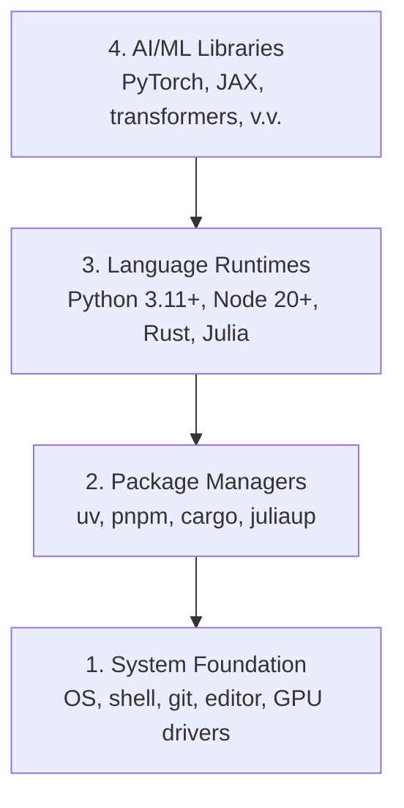

# Dev Environment

> Công cụ định hình cách bạn tư duy. Cài đặt một lần, cài đặt cho đúng.

- **Loại:** Build
- **Ngôn ngữ:** Python, Node.js, Rust
- **Yêu cầu trước:** Không có
- **Thời gian:** ~45 phút

## Mục tiêu học tập

- Cài đặt Python 3.11+, Node.js 20+, và Rust toolchains từ đầu
- Cấu hình virtual environments và package managers để build lại được
- Kiểm tra GPU với CUDA/MPS và chạy thử một phép tính tensor
- Hiểu bốn lớp của stack: system, packages, runtimes, AI libraries

## Vấn đề

Bạn sắp học AI engineering qua hơn 200 bài học sử dụng Python, TypeScript, Rust, và Julia. Nếu environment bị lỗi, mọi bài học sẽ trở thành cuộc chiến với công cụ thay vì học kiến thức.

Hầu hết mọi người bỏ qua bước cài đặt environment. Rồi họ mất hàng giờ để debug lỗi import, xung đột version, và thiếu CUDA drivers. Chúng ta sẽ làm việc này một lần cho đàng hoàng.

## Khái niệm

Một AI engineering environment có bốn lớp:



Chúng ta cài từ dưới lên. Mỗi lớp phụ thuộc vào lớp bên dưới nó.

## Bắt tay vào làm

### Bước 1: System Foundation

Kiểm tra hệ thống và cài đặt những thứ cơ bản.

```bash
# macOS
xcode-select --install
brew install git curl wget

# Ubuntu/Debian
sudo apt update && sudo apt install -y build-essential git curl wget

# Windows (dùng WSL2)
wsl --install -d Ubuntu-24.04
```

### Bước 2: Python với uv

Chúng ta dùng `uv` — nhanh hơn pip 10-100 lần và tự động quản lý virtual environments.

```bash
curl -LsSf https://astral.sh/uv/install.sh | sh

uv python install 3.12

uv venv
source .venv/bin/activate  # hoặc .venv\Scripts\activate trên Windows

uv pip install numpy matplotlib jupyter
```

Kiểm tra:

```python
import sys
print(f"Python {sys.version}")

import numpy as np
print(f"NumPy {np.__version__}")
a = np.array([1, 2, 3])
print(f"Vector: {a}, dot product với chính nó: {np.dot(a, a)}")
```

### Bước 3: Node.js với pnpm

Cho các bài học TypeScript (agents, MCP servers, web apps).

```bash
curl -fsSL https://fnm.vercel.app/install | bash
fnm install 22
fnm use 22

npm install -g pnpm

node -e "console.log('Node', process.version)"
```

### Bước 4: Rust

Cho các bài học cần hiệu năng cao (inference, systems).

```bash
curl --proto '=https' --tlsv1.2 -sSf https://sh.rustup.rs | sh

rustc --version
cargo --version
```

### Bước 5: Julia (Tùy chọn)

Cho các bài học nặng về toán, nơi Julia tỏa sáng.

```bash
curl -fsSL https://install.julialang.org | sh

julia -e 'println("Julia ", VERSION)'
```

### Bước 6: Cài đặt GPU (Nếu bạn có)

```bash
# NVIDIA
nvidia-smi

# Cài PyTorch với CUDA
uv pip install torch torchvision torchaudio --index-url https://download.pytorch.org/whl/cu124
```

```python
import torch
print(f"CUDA available: {torch.cuda.is_available()}")
if torch.cuda.is_available():
    print(f"GPU: {torch.cuda.get_device_name(0)}")
```

Không có GPU? Không sao. Hầu hết bài học chạy được trên CPU. Với các bài training nặng, dùng Google Colab hoặc cloud GPUs.

### Bước 7: Kiểm tra tất cả

Chạy script kiểm tra:

```bash
python phases/00-setup-and-tooling/01-dev-environment/code/verify.py
```

## Sử dụng

Environment của bạn đã sẵn sàng cho mọi bài học trong khóa này. Đây là nơi bạn sẽ dùng từng ngôn ngữ:

| Ngôn ngữ | Dùng trong | Package Manager |
|----------|------------|-----------------|
| Python | Phases 1-12 (ML, DL, NLP, Vision, Audio, LLMs) | uv |
| TypeScript | Phases 13-17 (Tools, Agents, Swarms, Infra) | pnpm |
| Rust | Phases 12, 15-17 (Hệ thống cần hiệu năng cao) | cargo |
| Julia | Phase 1 (Nền tảng toán học) | Pkg |

## Hoàn thành

Bài học này tạo ra một script kiểm tra mà ai cũng có thể chạy để kiểm tra cài đặt của mình.

Xem `outputs/prompt-env-check.md` để có prompt giúp AI assistants chẩn đoán các vấn đề về environment.

## Bài tập

1. Chạy script kiểm tra và sửa các lỗi nếu có
2. Tạo một Python virtual environment cho khóa học này và cài PyTorch
3. Viết "hello world" bằng cả bốn ngôn ngữ và chạy từng cái
