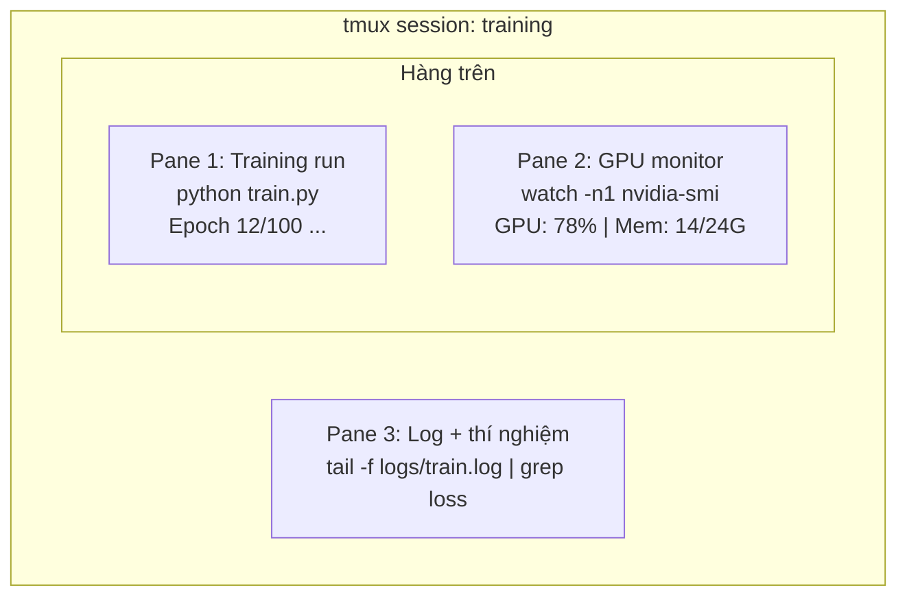

# Terminal & Shell

> Terminal là nơi các AI engineer sống. Hãy làm quen với nó.

- **Loại:** Học
- **Ngôn ngữ:** --
- **Yêu cầu trước:** Phase 0, Lesson 01
- **Thời gian:** ~35 phút

## Mục tiêu học tập

- Sử dụng piping, redirect, và `grep` để lọc và xử lý training log từ command line
- Tạo các tmux session bền vững với nhiều pane để chạy training và theo dõi GPU cùng lúc
- Theo dõi tài nguyên hệ thống và GPU với `htop`, `nvtop`, và `nvidia-smi`
- Truyền file giữa máy local và máy remote bằng SSH, `scp`, và `rsync`

## Vấn đề

Bạn sẽ dành nhiều thời gian trong terminal hơn bất kỳ editor nào. Training run, theo dõi GPU, xem log, SSH session, quản lý environment. Mọi workflow AI đều liên quan đến shell. Nếu bạn chậm ở đây, bạn sẽ chậm ở mọi nơi.

Bài học này bao gồm các kỹ năng terminal cần thiết cho công việc AI. Không có lịch sử Unix. Không đi sâu vào Bash scripting. Chỉ những gì bạn cần.

## Khái niệm



Ba thứ chạy cùng lúc. Một terminal. Bạn có thể detach, về nhà, SSH lại, và reattach. Training vẫn tiếp tục chạy.

## Thực hành

### Bước 1: Biết shell của bạn

Kiểm tra shell bạn đang dùng:

```bash
echo $SHELL
```

Hầu hết hệ thống dùng `bash` hoặc `zsh`. Cả hai đều hoạt động tốt. Các command trong khóa học này chạy được trên cả hai.

Những điều cần biết:

```bash
# Di chuyển
cd ~/projects/ai-engineering-from-scratch
pwd
ls -la

# Tìm kiếm lịch sử (phím tắt hữu ích nhất bạn sẽ học)
# Ctrl+R rồi gõ một phần command trước đó
# Nhấn Ctrl+R lần nữa để duyệt qua các kết quả

# Xóa terminal
clear   # hoặc Ctrl+L

# Hủy command đang chạy
# Ctrl+C

# Tạm dừng command đang chạy (tiếp tục bằng fg)
# Ctrl+Z
```

### Bước 2: Piping và redirect

Piping kết nối các command lại với nhau. Đây là cách bạn xử lý log, lọc output, và nối các công cụ lại. Bạn sẽ dùng cái này liên tục.

```bash
# Đếm số lần "loss" xuất hiện trong log
cat train.log | grep "loss" | wc -l

# Trích xuất chỉ các giá trị loss từ training output
grep "loss:" train.log | awk '{print $NF}' > losses.txt

# Xem file log cập nhật theo thời gian thực, lọc các error
tail -f train.log | grep --line-buffered "ERROR"

# Sắp xếp các thí nghiệm theo accuracy cuối cùng
grep "final_accuracy" results/*.log | sort -t= -k2 -n -r

# Redirect stdout và stderr ra các file riêng
python train.py > output.log 2> errors.log

# Redirect cả hai vào cùng một file
python train.py > train_full.log 2>&1
```

Ba loại redirect bạn cần biết:

| Ký hiệu | Chức năng |
|--------|-------------|
| `>` | Ghi stdout ra file (ghi đè) |
| `>>` | Nối thêm stdout vào file |
| `2>` | Ghi stderr ra file |
| `2>&1` | Gửi stderr đến cùng nơi với stdout |
| `\|` | Gửi stdout của command này làm stdin cho command tiếp theo |

### Bước 3: Background process

Training run mất hàng giờ. Bạn không muốn giữ terminal mở suốt thời gian đó.

```bash
# Chạy trong background (output vẫn hiện ra terminal)
python train.py &

# Chạy trong background, không bị ảnh hưởng khi đóng terminal
nohup python train.py > train.log 2>&1 &

# Kiểm tra những gì đang chạy trong background
jobs
ps aux | grep train.py

# Đưa background job lên foreground
fg %1

# Tắt một background process
kill %1
# hoặc tìm PID và kill nó
kill $(pgrep -f "train.py")
```

Sự khác nhau giữa `&`, `nohup`, và `screen`/`tmux`:

| Phương pháp | Sống sót khi đóng terminal? | Có thể reattach? |
|--------|-------------------------|---------------|
| `command &` | Không | Không |
| `nohup command &` | Có | Không (kiểm tra file log) |
| `screen` / `tmux` | Có | Có |

Với bất cứ thứ gì chạy lâu hơn vài phút, hãy dùng tmux.

### Bước 4: tmux

tmux cho phép bạn tạo các terminal session bền vững với nhiều pane. Đây là công cụ hữu ích nhất để quản lý training run.

```bash
# Cài đặt
# macOS
brew install tmux
# Ubuntu
sudo apt install tmux

# Bắt đầu một session có tên
tmux new -s training

# Chia ngang
# Ctrl+B rồi "

# Chia dọc
# Ctrl+B rồi %

# Di chuyển giữa các pane
# Ctrl+B rồi phím mũi tên

# Detach (session vẫn chạy)
# Ctrl+B rồi d

# Reattach
tmux attach -t training

# Liệt kê session
tmux ls

# Xóa một session
tmux kill-session -t training
```

Một workflow AI điển hình:

```bash
tmux new -s train

# Pane 1: bắt đầu training
python train.py --epochs 100 --lr 1e-4

# Ctrl+B, " để chia, rồi chạy GPU monitor
watch -n1 nvidia-smi

# Ctrl+B, % để chia dọc, xem log
tail -f logs/experiment.log

# Giờ detach bằng Ctrl+B, d
# SSH ra, đi uống cà phê, quay lại
# tmux attach -t train
```

### Bước 5: Theo dõi với htop và nvtop

```bash
# Process hệ thống (tốt hơn top)
htop

# Process GPU (nếu bạn có NVIDIA GPU)
# Cài đặt: sudo apt install nvtop (Ubuntu) hoặc brew install nvtop (macOS)
nvtop

# Kiểm tra GPU nhanh không cần nvtop
nvidia-smi

# Xem GPU usage cập nhật mỗi giây
watch -n1 nvidia-smi

# Xem process nào đang dùng GPU
nvidia-smi --query-compute-apps=pid,name,used_memory --format=csv
```

Các phím tắt `htop` bạn sẽ dùng:
- `F6` hoặc `>` để sắp xếp theo cột (sắp xếp theo memory để tìm memory leak)
- `F5` để bật/tắt tree view (xem child process)
- `F9` để kill một process
- `/` để tìm kiếm tên process

### Bước 6: SSH cho máy GPU remote

Khi bạn thuê cloud GPU (Lambda, RunPod, Vast.ai), bạn kết nối qua SSH.

```bash
# Kết nối cơ bản
ssh user@gpu-box-ip

# Với một key cụ thể
ssh -i ~/.ssh/my_gpu_key user@gpu-box-ip

# Copy file lên remote
scp model.pt user@gpu-box-ip:~/models/

# Copy file từ remote về
scp user@gpu-box-ip:~/results/metrics.json ./

# Sync cả thư mục (nhanh hơn với nhiều file)
rsync -avz ./data/ user@gpu-box-ip:~/data/

# Port forward (truy cập Jupyter/TensorBoard remote từ máy local)
ssh -L 8888:localhost:8888 user@gpu-box-ip
# Giờ mở localhost:8888 trên trình duyệt

# SSH config cho tiện
# Thêm vào ~/.ssh/config:
# Host gpu
#     HostName 192.168.1.100
#     User ubuntu
#     IdentityFile ~/.ssh/gpu_key
#
# Rồi chỉ cần:
# ssh gpu
```

### Bước 7: Alias hữu ích cho công việc AI

Thêm những dòng này vào `~/.bashrc` hoặc `~/.zshrc`:

```bash
source phases/00-setup-and-tooling/10-terminal-and-shell/code/shell_aliases.sh
```

Hoặc copy những cái bạn muốn. Các alias chính:

```bash
# Xem trạng thái GPU nhanh
alias gpu='nvidia-smi --query-gpu=index,name,utilization.gpu,memory.used,memory.total,temperature.gpu --format=csv,noheader'

# Kill tất cả Python training process
alias killtraining='pkill -f "python.*train"'

# Kích hoạt virtual environment nhanh
alias ae='source .venv/bin/activate'

# Theo dõi training loss
alias watchloss='tail -f logs/*.log | grep --line-buffered "loss"'
```

Xem `code/shell_aliases.sh` để xem đầy đủ.

### Bước 8: Các pattern terminal AI thường gặp

Những pattern này xuất hiện thường xuyên trong thực tế:

```bash
# Chạy training, log mọi thứ, thông báo khi xong
python train.py 2>&1 | tee train.log; echo "DONE" | mail -s "Training complete" you@email.com

# So sánh hai log thí nghiệm song song
diff <(grep "accuracy" exp1.log) <(grep "accuracy" exp2.log)

# Tìm các file model lớn nhất (dọn dẹp ổ đĩa)
find . -name "*.pt" -o -name "*.safetensors" | xargs du -h | sort -rh | head -20

# Tải model từ Hugging Face
wget https://huggingface.co/model/resolve/main/model.safetensors

# Giải nén dataset
tar xzf dataset.tar.gz -C ./data/

# Đếm số dòng trong tất cả file Python (xem project lớn cỡ nào)
find . -name "*.py" | xargs wc -l | tail -1

# Kiểm tra dung lượng ổ đĩa (training data lấp đầy ổ đĩa rất nhanh)
df -h
du -sh ./data/*

# Kiểm tra environment variable trước khi training
env | grep -i cuda
env | grep -i torch
```

## Sử dụng

Đây là lúc mỗi công cụ được dùng trong khóa học này:

| Công cụ | Khi nào dùng |
|------|----------------|
| tmux | Mỗi lần training run (Phase 3 trở đi) |
| `tail -f` + `grep` | Theo dõi training log |
| `nohup` / `&` | Tác vụ background nhanh |
| `htop` / `nvtop` | Debug training chậm, lỗi OOM |
| SSH + `rsync` | Làm việc trên cloud GPU |
| Piping + redirect | Xử lý kết quả thí nghiệm |
| Alias | Tiết kiệm thời gian cho các command lặp lại |

## Bài tập

1. Cài tmux, tạo một session với ba pane, và chạy `htop` trong một pane, `watch -n1 date` trong pane khác, và một Python script trong pane thứ ba. Detach và reattach.
2. Thêm các alias từ `code/shell_aliases.sh` vào shell config và tải lại bằng `source ~/.zshrc` (hoặc `~/.bashrc`).
3. Tạo một file training log giả bằng `for i in $(seq 1 100); do echo "epoch $i loss: $(echo "scale=4; 1/$i" | bc)"; sleep 0.1; done > fake_train.log` rồi dùng `grep`, `tail`, và `awk` để trích xuất chỉ các giá trị loss.
4. Thiết lập một SSH config entry cho server bạn có quyền truy cập (hoặc dùng `localhost` để thực hành cú pháp).

## Thuật ngữ chính

| Thuật ngữ | Cách mọi người nói | Ý nghĩa thực sự |
| ----- | -------------------------- | --------------------------------------------------------------------------------------------- |
| Shell | "The terminal" | Chương trình diễn giải các command của bạn (bash, zsh, fish) |
| tmux | "Terminal multiplexer" | Chương trình cho phép chạy nhiều terminal session trong một cửa sổ, và detach/reattach |
| Pipe | "Cái thanh dọc" | Toán tử `\|` gửi output của command này làm input cho command khác |
| PID | "Process ID" | Một số duy nhất gán cho mỗi process đang chạy, dùng để theo dõi hoặc kill nó |
| nohup | "No hangup" | Chạy command không bị ảnh hưởng bởi hangup signal, nên đóng terminal không kill nó |
| SSH | "Kết nối đến server" | Secure Shell, giao thức mã hóa để chạy command trên máy remote |
|       |                            |                                                                                               |
