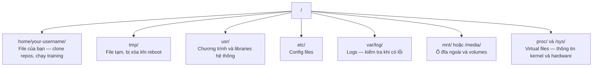

# Linux cho AI

> Hầu hết AI chạy trên Linux. Bạn cần biết đủ để không bị mắc kẹt.

**Type:** Learn
**Languages:** --
**Prerequisites:** Phase 0, Lesson 01
**Time:** ~30 phút

## Mục tiêu học tập

- Di chuyển trong file system Linux và thực hiện các thao tác file cơ bản từ command line
- Quản lý file permissions với `chmod` và `chown` để sửa lỗi "Permission denied"
- Cài đặt system packages bằng `apt` và thiết lập một GPU box mới cho công việc AI
- Nhận biết sự khác nhau giữa macOS và Linux mà hay làm developer bối rối khi làm việc trên remote machines

## Vấn đề

Bạn phát triển trên macOS hoặc Windows. Nhưng khi bạn SSH vào một cloud GPU box, thuê một Lambda instance, hay tạo một EC2 machine, bạn sẽ vào Ubuntu. Terminal là giao diện duy nhất của bạn. Không có Finder, không có Explorer, không có GUI. Nếu bạn không biết cách di chuyển trong file system, cài đặt packages, và quản lý processes từ command line, bạn sẽ bị kẹt — trả tiền cho GPU hours trong khi google "how to unzip a file in Linux."

Đây là hướng dẫn sinh tồn. Nó bao gồm chính xác những gì bạn cần để làm việc trên remote Linux machine cho AI. Không hơn.

## Cấu trúc File System

Linux tổ chức mọi thứ dưới một root `/` duy nhất. Không có `C:\` hay `/Volumes`. Các thư mục bạn sẽ thực sự dùng:



Home directory của bạn là `~` hoặc `/home/your-username`. Hầu hết mọi thứ bạn làm đều ở đây.

## Các lệnh cần thiết

Đây là 15 commands bao gồm 95% những gì bạn sẽ làm trên remote GPU box.

### Di chuyển

```bash
pwd                         # Tôi đang ở đâu?
ls                          # Có gì ở đây?
ls -la                      # Có gì ở đây, bao gồm hidden files với chi tiết?
cd /path/to/dir             # Đi tới đó
cd ~                        # Về home
cd ..                       # Lên một cấp
```

### Files và Directories

```bash
mkdir my-project            # Tạo directory
mkdir -p a/b/c              # Tạo nested directories một lần

cp file.txt backup.txt      # Copy file
cp -r src/ src-backup/      # Copy directory (recursive)

mv old.txt new.txt          # Đổi tên file
mv file.txt /tmp/           # Di chuyển file

rm file.txt                 # Xóa file (không có thùng rác, mất luôn)
rm -rf my-dir/              # Xóa directory và mọi thứ bên trong
```

`rm -rf` là vĩnh viễn. Không có undo. Kiểm tra kỹ path trước khi nhấn enter.

### Đọc Files

```bash
cat file.txt                # In toàn bộ file
head -20 file.txt           # 20 dòng đầu
tail -20 file.txt           # 20 dòng cuối
tail -f log.txt             # Theo dõi log file theo thời gian thực (Ctrl+C để dừng)
less file.txt               # Cuộn qua file (q để thoát)
```

### Tìm kiếm

```bash
grep "error" training.log           # Tìm dòng chứa "error"
grep -r "learning_rate" .           # Tìm trong tất cả files ở directory hiện tại
grep -i "cuda" config.yaml          # Tìm không phân biệt hoa thường

find . -name "*.py"                 # Tìm tất cả Python files trong directory hiện tại
find . -name "*.ckpt" -size +1G     # Tìm checkpoint files lớn hơn 1GB
```

## Permissions

Mỗi file trong Linux có một owner và permission bits. Bạn sẽ gặp vấn đề này khi scripts không chạy được hoặc bạn không ghi được vào directory.

```bash
ls -l train.py
# -rwxr-xr-- 1 user group 2048 Mar 19 10:00 train.py
#  ^^^             owner permissions: read, write, execute
#     ^^^          group permissions: read, execute
#        ^^        everyone else: read only
```

Cách sửa phổ biến:

```bash
chmod +x train.sh           # Cho phép script chạy được
chmod 755 deploy.sh         # Owner: full, others: read+execute
chmod 644 config.yaml       # Owner: read+write, others: read only

chown user:group file.txt   # Đổi owner của file (cần sudo)
```

Khi có thông báo "Permission denied," hầu hết là do permissions. `chmod +x` hoặc `sudo` sẽ sửa được phần lớn trường hợp.

## Quản lý Packages (apt)

Ubuntu dùng `apt`. Đây là cách bạn cài software ở system level.

```bash
sudo apt update             # Cập nhật danh sách packages (luôn làm việc này trước)
sudo apt install -y htop    # Cài một package (-y bỏ qua xác nhận)
sudo apt install -y build-essential  # C compiler, make, v.v. Nhiều Python packages cần cái này
sudo apt install -y tmux    # Terminal multiplexer (giữ sessions sống sau khi ngắt kết nối)

apt list --installed        # Đã cài gì?
sudo apt remove htop        # Gỡ cài đặt
```

Packages phổ biến bạn sẽ cài trên GPU box mới:

```bash
sudo apt update && sudo apt install -y \
    build-essential \
    git \
    curl \
    wget \
    tmux \
    htop \
    unzip \
    python3-venv
```

## Users và sudo

Bạn thường đăng nhập như regular user. Một số thao tác cần root (admin) access.

```bash
whoami                      # Tôi là user nào?
sudo command                # Chạy lệnh với quyền root
sudo su                     # Trở thành root (exit để quay lại, hạn chế dùng)
```

Trên cloud GPU instances, bạn thường là user duy nhất và đã có sudo access. Đừng chạy mọi thứ bằng root. Chỉ dùng sudo khi cần thiết.

## Processes và systemd

Khi training bị treo, hoặc bạn cần kiểm tra những gì đang chạy:

```bash
htop                        # Xem processes tương tác (q để thoát)
ps aux | grep python        # Tìm Python processes đang chạy
kill 12345                  # Dừng process nhẹ nhàng với PID 12345
kill -9 12345               # Force kill (dùng khi dừng nhẹ nhàng không được)
nvidia-smi                  # GPU processes và memory usage
```

systemd quản lý services (background daemons). Bạn sẽ dùng nó nếu chạy inference servers:

```bash
sudo systemctl start nginx          # Bắt đầu service
sudo systemctl stop nginx           # Dừng service
sudo systemctl restart nginx        # Khởi động lại
sudo systemctl status nginx         # Kiểm tra đang chạy không
sudo systemctl enable nginx         # Tự động bắt đầu khi boot
```

## Disk Space

GPU boxes thường có disk space giới hạn. Models và datasets lấp đầy nhanh lắm.

```bash
df -h                       # Disk usage cho tất cả drives đã mount
df -h /home                 # Disk usage cho /home cụ thể

du -sh *                    # Kích thước từng item trong directory hiện tại
du -sh ~/.cache             # Kích thước cache (pip, huggingface models nằm ở đây)
du -sh /data/checkpoints/   # Kiểm tra checkpoints lớn cỡ nào

# Tìm những thứ chiếm nhiều dung lượng nhất
du -h --max-depth=1 / 2>/dev/null | sort -hr | head -20
```

Cách tiết kiệm dung lượng phổ biến:

```bash
# Xóa pip cache
pip cache purge

# Xóa apt cache
sudo apt clean

# Xóa checkpoints cũ không cần
rm -rf checkpoints/epoch_01/ checkpoints/epoch_02/
```

## Networking

Bạn sẽ tải models, chuyển files, và gọi APIs từ command line.

```bash
# Tải files
wget https://example.com/model.bin                   # Tải file
curl -O https://example.com/data.tar.gz              # Tương tự với curl
curl -s https://api.example.com/health | python3 -m json.tool  # Gọi API, hiển thị JSON đẹp

# Chuyển files giữa các machines
scp model.bin user@remote:/data/                     # Copy file tới remote machine
scp user@remote:/data/results.csv .                  # Copy file từ remote về local
scp -r user@remote:/data/checkpoints/ ./local-dir/   # Copy directory

# Đồng bộ directories (nhanh hơn scp cho transfers lớn, tự nối lại khi bị ngắt)
rsync -avz --progress ./data/ user@remote:/data/
rsync -avz --progress user@remote:/results/ ./results/
```

Dùng `rsync` thay `scp` cho bất cứ thứ gì lớn. Nó chỉ chuyển bytes đã thay đổi và xử lý được kết nối bị ngắt.

## tmux: Giữ Sessions sống

Khi bạn SSH vào remote box, tắt laptop sẽ kill training run của bạn. tmux ngăn chặn điều này.

```bash
tmux new -s train           # Tạo session mới tên "train"
# ... bắt đầu training, sau đó:
# Ctrl+B, rồi D             # Detach (training vẫn chạy)

tmux ls                     # Liệt kê sessions
tmux attach -t train        # Gắn lại vào session

# Bên trong tmux:
# Ctrl+B, rồi %             # Chia pane dọc
# Ctrl+B, rồi "             # Chia pane ngang
# Ctrl+B, rồi phím mũi tên  # Chuyển giữa các panes
```

Luôn chạy training jobs dài trong tmux. Luôn luôn.

## WSL2 cho Windows Users

Nếu bạn dùng Windows, WSL2 cho bạn môi trường Linux thật mà không cần dual-booting.

```bash
# Trong PowerShell (admin)
wsl --install -d Ubuntu-24.04

# Sau khi restart, mở Ubuntu từ Start menu
sudo apt update && sudo apt upgrade -y
```

WSL2 chạy một Linux kernel thật. Mọi thứ trong bài học này đều hoạt động trong đó. Files Windows của bạn nằm ở `/mnt/c/Users/YourName/` khi ở trong WSL.

GPU passthrough hoạt động khi cài NVIDIA drivers ở phía Windows. Cài Windows NVIDIA driver (không phải Linux driver), và CUDA sẽ có sẵn trong WSL2.

## Lưu ý: macOS sang Linux

Những thứ sẽ làm bạn vấp nếu bạn chuyển từ macOS:

| macOS                       | Linux                          | Ghi chú                                                                                                                                                             |
| --------------------------- | ------------------------------ | ------------------------------------------------------------------------------------------------------------------------------------------------------------------- |
| `brew install`              | `sudo apt install`             | Tên package đôi khi khác. `brew install htop` vs `sudo apt install htop` giống nhau, nhưng `brew install readline` vs `sudo apt install libreadline-dev` thì không. |
| `open file.txt`             | `xdg-open file.txt`            | Nhưng bạn không có GUI trên remote box. Dùng `cat` hoặc `less`.                                                                                                     |
| `pbcopy` / `pbpaste`        | Không có sẵn                   | Copy/paste qua clipboard không tồn tại qua SSH.                                                                                                                     |
| `~/.zshrc`                  | `~/.bashrc`                    | macOS mặc định dùng zsh. Hầu hết Linux servers dùng bash.                                                                                                           |
| `/opt/homebrew/`            | `/usr/bin/`, `/usr/local/bin/` | Binaries nằm ở chỗ khác.                                                                                                                                            |
| `sed -i '' 's/a/b/' file`   | `sed -i 's/a/b/' file`         | macOS sed cần chuỗi rỗng sau `-i`. Linux thì không.                                                                                                                 |
| Case-insensitive filesystem | Case-sensitive filesystem      | `Model.py` và `model.py` là hai files khác nhau trên Linux.                                                                                                         |
| Line endings `\n`           | Line endings `\n`              | Giống nhau. Nhưng Windows dùng `\r\n`, sẽ làm hỏng bash scripts. Chạy `dos2unix` để sửa.                                                                            |

## Bảng tham khảo nhanh

```
Navigation:     pwd, ls, cd, find
Files:          cp, mv, rm, mkdir, cat, head, tail, less
Search:         grep, find
Permissions:    chmod, chown, sudo
Packages:       apt update, apt install
Processes:      htop, ps, kill, nvidia-smi
Services:       systemctl start/stop/restart/status
Disk:           df -h, du -sh
Network:        curl, wget, scp, rsync
Sessions:       tmux new/attach/detach
```

## Bài tập

1. SSH vào bất kỳ Linux machine nào (hoặc mở WSL2) và đi tới home directory. Tạo một project folder, tạo ba files trống bên trong bằng `touch`, rồi liệt kê chúng bằng `ls -la`.
2. Cài `htop` bằng apt, chạy nó, và tìm process nào đang dùng nhiều memory nhất.
3. Tạo một tmux session, chạy `sleep 300` bên trong, detach, liệt kê sessions, và reattach.
4. Dùng `df -h` để kiểm tra disk space còn trống, rồi dùng `du -sh ~/.cache/*` để tìm cái gì chiếm dung lượng trong cache.
5. Chuyển một file từ local machine sang remote machine bằng `scp`, rồi làm lại với `rsync` và so sánh trải nghiệm.

---

## Lời giải bài tập

### Bài 1: Tạo project folder và files

**Cách làm:**

```bash
cd ~                                # Về home directory
mkdir my-ai-project                 # Tạo project folder
cd my-ai-project                    # Vào folder
touch file1.txt file2.txt file3.txt # Tạo 3 files trống
ls -la                              # Liệt kê chi tiết
```

**Kết quả:**

```
total 8
drwxrwxr-x  2 lai lai 4096 Jul 22 15:12 .
drwxr-x--- 33 lai lai 4096 Jul 22 15:12 ..
-rw-rw-r--  1 lai lai    0 Jul 22 15:12 file1.txt
-rw-rw-r--  1 lai lai    0 Jul 22 15:12 file2.txt
-rw-rw-r--  1 lai lai    0 Jul 22 15:12 file3.txt
```

**Giải thích output `ls -la`:**

- `drwxrwxr-x` — directory, owner và group có full quyền, others có read+execute
- `-rw-rw-r--` — file thường, owner và group có read+write, others chỉ read
- Size `0` — files trống vì `touch` chỉ tạo file, không ghi nội dung
- `.` là directory hiện tại, `..` là directory cha

---

### Bài 2: Cài htop và tìm process dùng nhiều memory nhất

**Cách làm:**

```bash
# Bước 1: Cài htop
sudo apt update
sudo apt install -y htop

# Bước 2: Chạy htop
htop
# Nhấn M để sắp xếp theo memory
# Nhấn q để thoát
```

Nếu không có sudo, dùng `ps` thay thế:

```bash
ps aux --sort=-%mem | head -11
```

**Kết quả:**

```
USER         PID %CPU %MEM    VSZ   RSS TTY      STAT START   TIME COMMAND
lai         3884  9.8  2.4 56006400 798480 ?     Sl   07:29  45:57 /opt/google/chrome/chrome
lai         5016  3.4  2.2 1522745848 714604 ?   Sl   07:31  15:50 /snap/code/249/.../code --type=renderer
lai         6173  0.6  1.9 1524407008 642236 ?   Sl   07:32   2:46 /snap/code/249/.../code --type=utility
lai        13019  0.1  1.7 1522208896 554160 ?   Sl   08:15   0:45 /snap/code/249/.../server.bundle.js
lai         2693  3.2  1.1 4966236 383844 ?      Ssl  06:57  16:17 /usr/bin/gnome-shell
```

**Giải thích:**

- **%MEM** — phần trăm RAM đang dùng
- **RSS** — Resident Set Size, lượng RAM thực tế (tính bằng KB)
- Process dùng nhiều memory nhất: **Chrome** (2.4%, ~798MB)
- Tiếp theo là **VS Code** (2.2%, ~714MB)
- `--sort=-%mem` sắp xếp giảm dần theo memory

---

### Bài 3: tmux session

**Cách làm:**

```bash
# Bước 1: Tạo session mới tên "train"
tmux new -s train

# Bước 2: Bên trong tmux, chạy sleep
sleep 300

# Bước 3: Detach — nhấn Ctrl+B, rồi nhấn D
# (bạn sẽ thấy thông báo "[detached (from session train)]")

# Bước 4: Liệt kê sessions
tmux ls

# Bước 5: Gắn lại vào session
tmux attach -t train
```

Hoặc tạo session ở background luôn (không cần detach thủ công):

```bash
tmux new-session -d -s train 'sleep 300'
tmux ls
tmux attach -t train
```

**Kết quả `tmux ls`:**

```
train: 1 windows (created Wed Jul 22 15:15:18 2026)
```

**Giải thích:**

- `tmux new -s train` — tạo session với tên "train" để dễ nhớ
- `Ctrl+B, D` — detach, thoát ra ngoài nhưng session vẫn chạy
- `tmux ls` — kiểm tra sessions đang chạy
- `tmux attach -t train` — gắn lại vào session
- Khi bạn SSH vào remote box và chạy training, luôn dùng tmux. Nếu mạng bị ngắt, training vẫn chạy.

---

### Bài 4: Kiểm tra disk space

**Cách làm:**

```bash
# Bước 1: Kiểm tra disk space tổng
df -h

# Bước 2: Kiểm tra cache
du -sh ~/.cache/

# Bước 3: Xem chi tiết trong cache, sắp xếp theo kích thước
du -sh ~/.cache/* | sort -hr | head -15
```

**Kết quả `df -h`:**

```
Filesystem      Size  Used Avail Use% Mounted on
/dev/nvme0n1p2  937G   61G  829G   7% /
```

**Kết quả `du -sh ~/.cache/*`:**

```
27G     /home/lai/.cache/uv
1.6G    /home/lai/.cache/google-chrome
646M    /home/lai/.cache/ms-playwright
109M    /home/lai/.cache/@zcodedesktop-updater
30M     /home/lai/.cache/Homebrew
16M     /home/lai/.cache/tracker3
```

**Giải thích:**

- **Disk tổng:** 937GB, đã dùng 61GB (7%), còn trống 829GB
- **Cache chiếm 29GB**, trong đó `uv` (Python package manager) chiếm 27GB — nhiều nhất
- Để giải phóng dung lượng, chạy: `pip cache purge`, `sudo apt clean`, hoặc xóa checkpoints cũ

---

### Bài 5: Chuyển file bằng scp và rsync

**Cách làm:**

```bash
# Tạo file test
echo "test data for transfer" > test-transfer.txt

# Cách 1: Dùng scp
scp test-transfer.txt user@remote-server:/home/user/

# Cách 2: Dùng rsync
rsync -avz --progress test-transfer.txt user@remote-server:/home/user/
```

Demo rsync ở local (không cần remote machine):

```bash
mkdir -p ~/backup
rsync -avz --progress test-transfer.txt ~/backup/
```

**Kết quả rsync:**

```
sending incremental file list
test-transfer.txt
             33 100%    0.00kB/s    0:00:00
             33 100%    0.00kB/s    0:00:00 (xfr#1, to-chk=0/1)

sent 151 bytes  received 35 bytes  372.00 bytes/sec
total size is 33  speedup is 0.18
```

**So sánh scp vs rsync:**

| | `scp` | `rsync` |
|---|---|---|
| **Cách hoạt động** | Copy toàn bộ file mỗi lần | Chỉ copy bytes đã thay đổi |
| **Bị ngắt kết nối** | Phải copy lại từ đầu | Tiếp tục từ chỗ dừng |
| **Hiển thị tiến trình** | Có (cơ bản) | Có (`--progress`, chi tiết hơn) |
| **File lớn / nhiều files** | Chậm | Nhanh hơn nhiều |
| **Khi nào dùng** | File nhỏ, chuyển nhanh | Mọi thứ lớn hoặc cần đồng bộ |

**Kết luận:** Dùng `rsync` thay `scp` cho bất cứ thứ gì lớn. Đặc biệt khi chuyển models (vài GB) hoặc datasets, `rsync` tiết kiệm thời gian vì chỉ gửi phần thay đổi.
