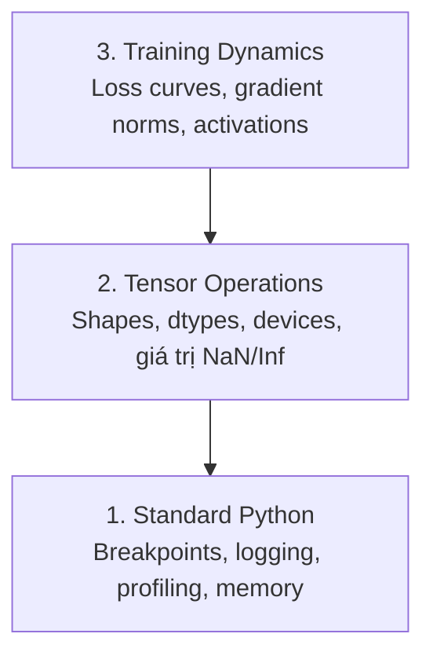

# Debugging và Profiling

> Những bug AI tệ nhất không crash. Chúng âm thầm train trên dữ liệu rác và báo cáo một loss curve đẹp đẽ.

**Type:** Build
**Language:** Python
**Prerequisites:** Lesson 1 (Dev Environment), quen thuộc cơ bản với PyTorch
**Time:** ~60 phút

## Mục tiêu học tập

- Sử dụng `breakpoint()` có điều kiện và `debug_print` để kiểm tra tensor shapes, dtypes, và giá trị NaN trong quá trình training
- Profile các training loops với `cProfile`, `line_profiler`, và `tracemalloc` để tìm bottlenecks
- Phát hiện các bug AI phổ biến: shape mismatches, NaN loss, data leakage, và wrong-device tensors
- Thiết lập TensorBoard để trực quan hóa loss curves, weight histograms, và gradient distributions

## Vấn đề

Code AI lỗi khác với code thông thường. Một web app crash với stack trace. Một training loop cấu hình sai chạy 8 tiếng, đốt $200 tiền GPU, và tạo ra model chỉ predict giá trị trung bình của mọi input. Code không bao giờ báo lỗi. Bug là một tensor ở sai device, một `.detach()` bị quên, hoặc labels bị rò rỉ vào features.

Bạn cần các công cụ debugging để bắt những lỗi âm thầm này trước khi chúng lãng phí thời gian và compute của bạn.

## Khái niệm

AI debugging hoạt động ở ba cấp độ:



Hầu hết mọi người nhảy thẳng lên cấp 3 (nhìn chằm chằm vào TensorBoard). Nhưng 80% bug AI nằm ở cấp 1 và 2.

## Xây dựng

### Phần 1: Print Debugging (Đúng vậy, nó hoạt động)

Print debugging hay bị xem thường. Không nên thế. Với tensor code, một câu print có mục tiêu hiệu quả hơn việc step qua debugger vì bạn cần thấy shapes, dtypes, và value ranges cùng lúc.

```python
def debug_print(name, tensor):
    print(f"{name}: shape={tensor.shape}, dtype={tensor.dtype}, "
          f"device={tensor.device}, "
          f"min={tensor.min().item():.4f}, max={tensor.max().item():.4f}, "
          f"mean={tensor.mean().item():.4f}, "
          f"has_nan={tensor.isnan().any().item()}")
```

Gọi hàm này sau mỗi operation đáng ngờ. Khi tìm thấy bug, xóa các print đi. Đơn giản.

### Phần 2: Python Debugger (pdb và breakpoint)

Debugger tích hợp sẵn bị đánh giá thấp cho công việc AI. Đặt `breakpoint()` vào training loop và kiểm tra tensors một cách tương tác.

```python
def training_step(model, batch, criterion, optimizer):
    inputs, labels = batch
    outputs = model(inputs)
    loss = criterion(outputs, labels)

    if loss.item() > 100 or torch.isnan(loss):
        breakpoint()

    loss.backward()
    optimizer.step()
```

Khi debugger dừng lại, các lệnh hữu ích:

- `p outputs.shape` để kiểm tra shapes
- `p loss.item()` để xem giá trị loss
- `p torch.isnan(outputs).sum()` để đếm NaNs
- `p model.fc1.weight.grad` để kiểm tra gradients
- `c` để tiếp tục, `q` để thoát

Đây là conditional debugging. Bạn chỉ dừng khi có gì đó trông sai. Với một training run 10.000 steps, điều này rất quan trọng.

### Phần 3: Python Logging

Thay thế print statements bằng logging khi việc debugging vượt ra ngoài một lần kiểm tra nhanh.

```python
import logging

logging.basicConfig(
    level=logging.INFO,
    format="%(asctime)s [%(levelname)s] %(message)s",
    handlers=[
        logging.FileHandler("training.log"),
        logging.StreamHandler()
    ]
)
logger = logging.getLogger(__name__)

logger.info("Starting training: lr=%.4f, batch_size=%d", lr, batch_size)
logger.warning("Loss spike detected: %.4f at step %d", loss.item(), step)
logger.error("NaN loss at step %d, stopping", step)
```

Logging cho bạn timestamps, severity levels, và file output. Khi training run lỗi lúc 3 giờ sáng, bạn muốn có log file, không phải terminal output đã cuộn mất khỏi màn hình.

### Phần 4: Đo thời gian các đoạn code

Biết thời gian tiêu tốn ở đâu là bước đầu tiên để tối ưu hóa.

```python
import time

class Timer:
    def __init__(self, name=""):
        self.name = name

    def __enter__(self):
        self.start = time.perf_counter()
        return self

    def __exit__(self, *args):
        elapsed = time.perf_counter() - self.start
        print(f"[{self.name}] {elapsed:.4f}s")

with Timer("data loading"):
    batch = next(dataloader_iter)

with Timer("forward pass"):
    outputs = model(batch)

with Timer("backward pass"):
    loss.backward()
```

Phát hiện thường gặp: data loading chiếm 60% thời gian training. Cách sửa là `num_workers > 0` trong DataLoader, không phải GPU nhanh hơn.

### Phần 5: cProfile và line_profiler

Khi bạn cần nhiều hơn các timer thủ công:

```bash
python -m cProfile -s cumtime train.py
```

Lệnh này hiển thị mọi function call được sắp xếp theo cumulative time. Để profiling từng dòng:

```bash
pip install line_profiler
```

```python
@profile
def train_step(model, data, target):
    output = model(data)
    loss = F.cross_entropy(output, target)
    loss.backward()
    return loss

# Chạy với: kernprof -l -v train.py
```

### Phần 6: Memory Profiling

#### CPU Memory với tracemalloc

```python
import tracemalloc

tracemalloc.start()

# code của bạn ở đây
model = build_model()
data = load_dataset()

snapshot = tracemalloc.take_snapshot()
top_stats = snapshot.statistics("lineno")
for stat in top_stats[:10]:
    print(stat)
```

#### CPU Memory với memory_profiler

```bash
pip install memory_profiler
```

```python
from memory_profiler import profile

@profile
def load_data():
    raw = read_csv("data.csv")       # theo dõi memory tăng ở đây
    processed = preprocess(raw)       # và ở đây
    return processed
```

Chạy với `python -m memory_profiler your_script.py` để xem memory usage từng dòng.

#### GPU Memory với PyTorch

```python
import torch

if torch.cuda.is_available():
    print(torch.cuda.memory_summary())

    print(f"Allocated: {torch.cuda.memory_allocated() / 1e9:.2f} GB")
    print(f"Cached: {torch.cuda.memory_reserved() / 1e9:.2f} GB")
```

Khi bạn gặp OOM (Out of Memory):

1. Giảm batch size (luôn thử đầu tiên)
2. Dùng `torch.cuda.empty_cache()` để giải phóng cached memory
3. Dùng `del tensor` rồi `torch.cuda.empty_cache()` cho các intermediate tensors lớn
4. Dùng mixed precision (`torch.cuda.amp`) để giảm một nửa memory usage
5. Dùng gradient checkpointing cho các model rất sâu

### Phần 7: Các bug AI phổ biến và cách bắt chúng

#### Shape Mismatch

Bug thường gặp nhất. Một tensor có shape `[batch, features]` trong khi model mong đợi `[batch, channels, height, width]`.

```python
def check_shapes(model, sample_input):
    print(f"Input: {sample_input.shape}")
    hooks = []

    def make_hook(name):
        def hook(module, inp, out):
            in_shape = inp[0].shape if isinstance(inp, tuple) else inp.shape
            out_shape = out.shape if hasattr(out, "shape") else type(out)
            print(f"  {name}: {in_shape} -> {out_shape}")
        return hook

    for name, module in model.named_modules():
        hooks.append(module.register_forward_hook(make_hook(name)))

    with torch.no_grad():
        model(sample_input)

    for h in hooks:
        h.remove()
```

Chạy hàm này một lần với sample batch. Nó vẽ ra mọi shape transformation trong model của bạn.

#### NaN Loss

NaN loss nghĩa là có gì đó đã bùng nổ. Nguyên nhân phổ biến:

- Learning rate quá cao
- Chia cho 0 trong custom loss
- Log của 0 hoặc số âm
- Exploding gradients trong RNNs

```python
def detect_nan(model, loss, step):
    if torch.isnan(loss):
        print(f"NaN loss at step {step}")
        for name, param in model.named_parameters():
            if param.grad is not None:
                if torch.isnan(param.grad).any():
                    print(f"  NaN gradient in {name}")
                if torch.isinf(param.grad).any():
                    print(f"  Inf gradient in {name}")
        return True
    return False
```

#### Data Leakage

Model của bạn đạt 99% accuracy trên test set. Nghe tuyệt vời. Đó là bug.

```python
def check_data_leakage(train_set, test_set, id_column="id"):
    train_ids = set(train_set[id_column].tolist())
    test_ids = set(test_set[id_column].tolist())
    overlap = train_ids & test_ids
    if overlap:
        print(f"DATA LEAKAGE: {len(overlap)} samples in both train and test")
        return True
    return False
```

Cũng kiểm tra temporal leakage: dùng dữ liệu tương lai để predict quá khứ. Sắp xếp theo timestamp trước khi split.

#### Wrong Device

Tensors trên các devices khác nhau (CPU vs GPU) gây ra runtime errors. Nhưng đôi khi một tensor âm thầm ở lại CPU trong khi mọi thứ khác ở GPU, và training chỉ chạy chậm.

```python
def check_devices(model, *tensors):
    model_device = next(model.parameters()).device
    print(f"Model device: {model_device}")
    for i, t in enumerate(tensors):
        if t.device != model_device:
            print(f"  WARNING: tensor {i} on {t.device}, model on {model_device}")
```

### Phần 8: TensorBoard cơ bản

TensorBoard cho bạn thấy điều gì đang xảy ra bên trong training theo thời gian.

```bash
pip install tensorboard
```

```python
from torch.utils.tensorboard import SummaryWriter

writer = SummaryWriter("runs/experiment_1")

for step in range(num_steps):
    loss = train_step(model, batch)

    writer.add_scalar("loss/train", loss.item(), step)
    writer.add_scalar("lr", optimizer.param_groups[0]["lr"], step)

    if step % 100 == 0:
        for name, param in model.named_parameters():
            writer.add_histogram(f"weights/{name}", param, step)
            if param.grad is not None:
                writer.add_histogram(f"grads/{name}", param.grad, step)

writer.close()
```

Khởi chạy:

```bash
tensorboard --logdir=runs
```

Cần chú ý:

- **Loss không giảm**: Learning rate quá thấp, hoặc vấn đề kiến trúc model
- **Loss dao động mạnh**: Learning rate quá cao
- **Loss thành NaN**: Numerical instability (xem phần NaN ở trên)
- **Train loss giảm, val loss tăng**: Overfitting
- **Weight histograms co về 0**: Vanishing gradients
- **Gradient histograms bùng nổ**: Cần gradient clipping

### Phần 9: VS Code Debugger

Để debugging tương tác, cấu hình VS Code với `launch.json`:

```json
{
    "version": "0.2.0",
    "configurations": [
        {
            "name": "Debug Training",
            "type": "debugpy",
            "request": "launch",
            "program": "${file}",
            "console": "integratedTerminal",
            "justMyCode": false
        }
    ]
}
```

Đặt breakpoints bằng cách click vào gutter. Dùng Variables pane để kiểm tra các thuộc tính tensor. Debug Console cho phép bạn chạy bất kỳ biểu thức Python nào giữa quá trình thực thi.

Hữu ích cho việc step qua các data preprocessing pipelines khi bạn muốn thấy từng transformation.

## Sử dụng

Đây là quy trình debugging bắt được hầu hết bug AI:

1. **Trước khi training**: Chạy `check_shapes` với sample batch. Xác nhận input và output dimensions khớp với kỳ vọng.
2. **10 steps đầu tiên**: Dùng `debug_print` cho loss, outputs, và gradients. Xác nhận không có NaN và giá trị nằm trong phạm vi hợp lý.
3. **Trong quá trình training**: Log loss, learning rate, và gradient norms. Dùng TensorBoard để trực quan hóa.
4. **Khi có gì đó hỏng**: Đặt `breakpoint()` tại điểm lỗi. Kiểm tra tensors tương tác.
5. **Về hiệu năng**: Đo thời gian data loading vs forward vs backward pass. Profile memory nếu bạn sắp OOM.

## Triển khai

Chạy script debugging toolkit:

```bash
python phases/00-setup-and-tooling/12-debugging-and-profiling/code/debug_tools.py
```

Xem `outputs/prompt-debug-ai-code.md` để có prompt giúp chẩn đoán các bug đặc thù AI.

## Bài tập

1. Chạy `debug_tools.py` và đọc qua output của từng phần. Sửa dummy model để tạo NaN (gợi ý: chia cho 0 trong forward pass) và xem detector bắt được nó.
2. Profile một training loop với `cProfile` và xác định function chậm nhất.
3. Dùng `tracemalloc` để tìm dòng nào trong data loading pipeline cấp phát nhiều memory nhất.
4. Thiết lập TensorBoard cho một training run đơn giản và xác định model có bị overfitting không.
5. Dùng `breakpoint()` bên trong training loop. Thực hành kiểm tra tensor shapes, devices, và gradient values từ debugger prompt.
