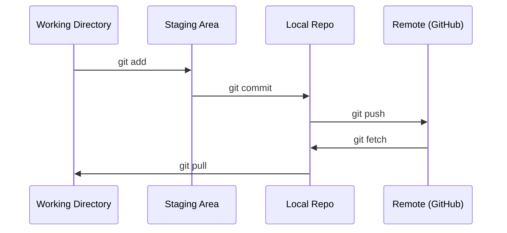

# Git & Collaboration

> Version control không phải là tuỳ chọn. Mọi thí nghiệm, mọi model, mọi bài học bạn xây ở đây đều được theo dõi.

- **Loại:** Học
- **Ngôn ngữ:** --
- **Yêu cầu trước:** Phase 0, Lesson 01
- **Thời gian:** ~30 phút

## Mục tiêu học tập

- Cấu hình git identity và sử dụng quy trình hàng ngày: add, commit, và push
- Tạo và merge branch để thử nghiệm riêng biệt mà không làm hỏng main
- Viết file `.gitignore` để loại trừ model checkpoint và các file nhị phân lớn
- Xem lịch sử commit bằng `git log` để hiểu quá trình phát triển dự án

## Vấn đề

Bạn sắp viết hàng trăm file code qua 20 phase. Nếu không có version control, bạn sẽ mất code, làm hỏng những thứ không thể hoàn tác, và không có cách nào để cộng tác với người khác.

Git là công cụ. GitHub là nơi lưu trữ code. Bài học này chỉ dạy những gì bạn cần cho khoá học này, không hơn.

## Khái niệm



Ba điều cần nhớ:
1. Lưu thường xuyên (`git commit`)
2. Push lên remote (`git push`)
3. Tạo branch khi thử nghiệm (`git checkout -b experiment`)

## Thực hành

### Bước 1: Cấu hình git

```bash
git config --global user.name "Your Name"
git config --global user.email "you@example.com"
```

### Bước 2: Quy trình hàng ngày

```bash
git status
git add file.py
git commit -m "Add perceptron implementation"
git push origin main
```

### Bước 3: Tạo branch để thử nghiệm

```bash
git checkout -b experiment/new-optimizer

# ... thay đổi code, commit ...

git checkout main
git merge experiment/new-optimizer
```

### Bước 4: Làm việc với repo của khoá học

```bash
git clone https://github.com/rohitg00/ai-engineering-from-scratch.git
cd ai-engineering-from-scratch

git checkout -b my-progress
# làm bài, commit code của bạn
git push origin my-progress
```

## Sử dụng

Trong khoá học này, bạn chỉ cần đúng những lệnh sau:

| Lệnh | Khi nào dùng |
|---------|---------|
| `git clone` | Lấy repo của khoá học |
| `git add` + `git commit` | Lưu lại công việc |
| `git push` | Sao lưu lên GitHub |
| `git checkout -b` | Thử nghiệm mà không làm hỏng main |
| `git log --oneline` | Xem những gì bạn đã làm |

Vậy thôi. Bạn không cần rebase, cherry-pick, hay submodules cho khoá học này.

## Bài tập

1. Clone repo này, tạo branch tên `my-progress`, tạo một file, commit, rồi push
2. Tạo file `.gitignore` để loại trừ các file model checkpoint (`.pt`, `.pth`, `.safetensors`)
3. Xem lịch sử commit của repo này bằng `git log --oneline` và đọc cách các bài học được thêm vào

## Thuật ngữ chính

| Thuật ngữ | Người ta hay nói | Nghĩa thực sự |
|------|----------------|----------------------|
| Commit | "Lưu lại" | Một bản snapshot toàn bộ dự án tại một thời điểm |
| Branch | "Một bản sao" | Một con trỏ đến commit, di chuyển về phía trước khi bạn làm việc |
| Merge | "Gộp code" | Lấy thay đổi từ branch này áp dụng vào branch khác |
| Remote | "Trên cloud" | Một bản sao của repo được lưu ở nơi khác (GitHub, GitLab) |
