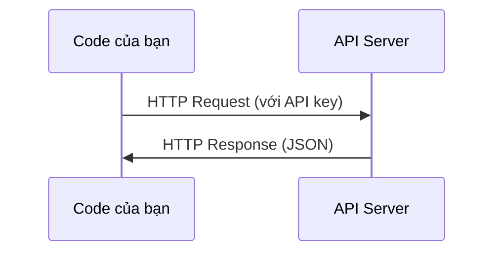

# APIs & Keys

> Mọi AI API đều hoạt động giống nhau: gửi một request, nhận một response. Chi tiết thay đổi, nhưng pattern thì không.

- **Loại:** Build
- **Ngôn ngữ:** Python, TypeScript
- **Yêu cầu trước:** Phase 0, Lesson 01
- **Thời gian:** ~30 phút

## Mục tiêu học tập

- Lưu trữ API key an toàn bằng environment variables và file `.env`
- Thực hiện một LLM API call bằng cả Anthropic Python SDK và raw HTTP
- So sánh format request/response giữa SDK và raw HTTP để debug
- Nhận biết và xử lý các lỗi API phổ biến bao gồm authentication và rate limits

## Vấn đề

Bắt đầu từ Phase 11, bạn sẽ gọi các LLM API (Anthropic, OpenAI, Google). Trong Phase 13-16 bạn sẽ xây dựng các agent sử dụng các API này trong các vòng lặp. Bạn cần biết API key hoạt động như thế nào, cách lưu trữ chúng an toàn, và cách thực hiện API call đầu tiên.

## Khái niệm



Mỗi API call gồm có:
1. Một endpoint (URL)
2. Một API key (authentication)
3. Một request body (cái bạn muốn)
4. Một response body (cái bạn nhận lại)

## Xây dựng

### Bước 1: Lưu trữ API key an toàn

Không bao giờ đặt API key trong code. Hãy dùng environment variables.

```bash
export ANTHROPIC_API_KEY="sk-ant-..."
export OPENAI_API_KEY="sk-..."
```

Hoặc dùng file `.env` (thêm nó vào `.gitignore`):

```
ANTHROPIC_API_KEY=sk-ant-...
OPENAI_API_KEY=sk-...
```

### Bước 2: API call đầu tiên (Python)

```python
import anthropic

client = anthropic.Anthropic()

response = client.messages.create(
    model="claude-sonnet-4-20250514",
    max_tokens=256,
    messages=[{"role": "user", "content": "What is a neural network in one sentence?"}]
)

print(response.content[0].text)
```

### Bước 3: API call đầu tiên (TypeScript)

```typescript
import Anthropic from "@anthropic-ai/sdk";

const client = new Anthropic();

const response = await client.messages.create({
  model: "claude-sonnet-4-20250514",
  max_tokens: 256,
  messages: [{ role: "user", content: "What is a neural network in one sentence?" }],
});

console.log(response.content[0].text);
```

### Bước 4: Raw HTTP (không dùng SDK)

```python
import os
import urllib.request
import json

url = "https://api.anthropic.com/v1/messages"
headers = {
    "Content-Type": "application/json",
    "x-api-key": os.environ["ANTHROPIC_API_KEY"],
    "anthropic-version": "2023-06-01",
}
body = json.dumps({
    "model": "claude-sonnet-4-20250514",
    "max_tokens": 256,
    "messages": [{"role": "user", "content": "What is a neural network in one sentence?"}],
}).encode()

req = urllib.request.Request(url, data=body, headers=headers, method="POST")
with urllib.request.urlopen(req) as resp:
    result = json.loads(resp.read())
    print(result["content"][0]["text"])
```

Đây là những gì các SDK làm bên trong. Hiểu được raw HTTP call sẽ giúp bạn khi debug.

## Sử dụng

Cho khóa học này:

| API | Khi nào bạn cần | Free tier |
|-----|-----------------|-----------|
| Anthropic (Claude) | Phase 11-16 (agents, tools) | $5 credit khi đăng ký |
| OpenAI | Phase 11 (so sánh) | $5 credit khi đăng ký |
| Hugging Face | Phase 4-10 (models, datasets) | Miễn phí |

Bạn không cần tất cả ngay bây giờ. Hãy cài đặt khi bài học yêu cầu.

## Kết quả

Bài học này tạo ra:
- `outputs/prompt-api-troubleshooter.md` - chẩn đoán các lỗi API phổ biến

## Bài tập

1. Lấy một Anthropic API key và thực hiện API call đầu tiên
2. Thử phiên bản raw HTTP và so sánh format response với phiên bản SDK
3. Cố tình dùng sai API key và đọc thông báo lỗi

## Thuật ngữ chính

| Thuật ngữ | Cách mọi người hay nói | Ý nghĩa thực sự |
|-----------|----------------------|-----------------|
| API key | "Password cho API" | Một chuỗi ký tự duy nhất dùng để xác định tài khoản và cho phép các request |
| Rate limit | "Họ đang throttle tôi" | Số request tối đa mỗi phút/giờ để ngăn lạm dụng và đảm bảo sử dụng công bằng |
| Token | "Một từ" (trong ngữ cảnh API) | Đơn vị tính phí: input token và output token được đếm và tính phí riêng |
| Streaming | "Response thời gian thực" | Nhận response từng từ một thay vì đợi toàn bộ response |
