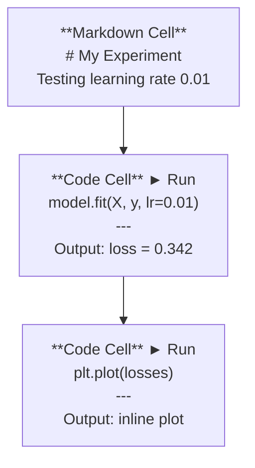
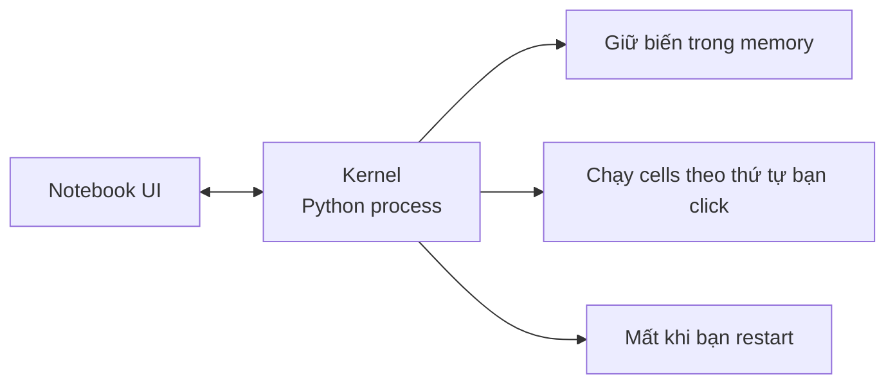

# Jupyter Notebooks

> Notebooks là bàn thí nghiệm của AI engineering. Bạn thử nghiệm ở đây, rồi chuyển những gì hoạt động sang production.

- **Type:** Build
- **Languages:** Python
- **Prerequisites:** Phase 0, Lesson 01
- **Time:** ~30 phút

## Mục tiêu học tập

- Cài đặt và khởi chạy JupyterLab, Jupyter Notebook, hoặc VS Code với Jupyter extension
- Sử dụng magic commands (`%timeit`, `%%time`, `%matplotlib inline`) để đo hiệu năng và hiển thị biểu đồ inline
- Phân biệt khi nào dùng notebooks và khi nào dùng scripts, áp dụng quy trình "explore in notebooks, ship in scripts"
- Nhận biết và tránh các bẫy thường gặp của notebook: thực thi không đúng thứ tự, hidden state, và memory leaks

## Vấn đề

Mọi bài báo AI, tutorial, và cuộc thi Kaggle đều dùng Jupyter notebooks. Chúng cho phép bạn chạy code từng phần, xem output ngay bên dưới, kết hợp code với giải thích, và lặp lại nhanh. Nếu bạn cố học AI mà không dùng notebooks, giống như làm bài toán mà không có giấy nháp.

Nhưng notebooks có những cái bẫy thực sự. Mọi người dùng chúng cho mọi thứ, kể cả những việc mà chúng rất tệ. Biết khi nào dùng notebook và khi nào dùng script sẽ giúp bạn tránh được những cơn ác mộng debug sau này.

## Khái niệm

Một notebook là danh sách các cells. Mỗi cell là code hoặc text.



Kernel là một Python process chạy ngầm. Khi bạn chạy một cell, nó gửi code đến kernel, kernel thực thi và trả về kết quả. Tất cả cells dùng chung một kernel, nên các biến vẫn tồn tại giữa các cells.



Phần "theo thứ tự bạn click" đó vừa là sức mạnh vừa là cái bẫy.

## Thực hành

### Bước 1: Chọn giao diện

Ba lựa chọn, một format:

| Giao diện | Cài đặt | Phù hợp cho |
|-----------|---------|------------|
| JupyterLab | `pip install jupyterlab` rồi `jupyter lab` | Trải nghiệm IDE đầy đủ, nhiều tabs, file browser, terminal |
| Jupyter Notebook | `pip install notebook` rồi `jupyter notebook` | Đơn giản, nhẹ, mỗi lần một notebook |
| VS Code | Cài extension "Jupyter" | Đã ở trong editor, tích hợp git, debugging |

Cả ba đều đọc và ghi cùng file `.ipynb`. Chọn cái nào bạn thích. JupyterLab phổ biến nhất trong AI.

```bash
pip install jupyterlab
jupyter lab
```

### Bước 2: Keyboard shortcuts quan trọng

Bạn thao tác trong hai mode. Nhấn `Escape` cho command mode (thanh xanh dương bên trái), `Enter` cho edit mode (thanh xanh lá).

**Command mode (dùng nhiều nhất):**

| Phím | Hành động |
|------|-----------|
| `Shift+Enter` | Chạy cell, chuyển sang cell tiếp |
| `A` | Thêm cell phía trên |
| `B` | Thêm cell phía dưới |
| `DD` | Xoá cell |
| `M` | Chuyển sang markdown |
| `Y` | Chuyển sang code |
| `Z` | Hoàn tác thao tác cell |
| `Ctrl+Shift+H` | Hiện tất cả shortcuts |

**Edit mode:**

| Phím | Hành động |
|------|-----------|
| `Tab` | Tự động hoàn thành |
| `Shift+Tab` | Hiện function signature |
| `Ctrl+/` | Bật/tắt comment |

`Shift+Enter` là phím bạn sẽ dùng cả nghìn lần mỗi ngày. Học nó trước.

### Bước 3: Các loại cell

**Code cells** chạy Python và hiển thị output:

```python
import numpy as np
data = np.random.randn(1000)
data.mean(), data.std()
```

Output: `(0.0032, 0.9987)`

**Markdown cells** hiển thị text có format. Dùng chúng để ghi lại bạn đang làm gì và tại sao. Hỗ trợ headers, bold, italic, LaTeX math (`$E = mc^2$`), tables, và images.

### Bước 4: Magic commands

Đây không phải Python. Đây là các lệnh riêng của Jupyter bắt đầu bằng `%` (line magic) hoặc `%%` (cell magic).

**Đo thời gian code:**

```python
%timeit np.random.randn(10000)
```

Output: `45.2 us +/- 1.3 us per loop`

```python
%%time
model.fit(X_train, y_train, epochs=10)
```

Output: `Wall time: 2.34 s`

`%timeit` chạy code nhiều lần rồi lấy trung bình. `%%time` chạy một lần. Dùng `%timeit` cho microbenchmarks, `%%time` cho training runs.

**Bật inline plots:**

```python
%matplotlib inline
```

Mọi `plt.plot()` hoặc `plt.show()` giờ sẽ hiển thị trực tiếp trong notebook.

**Cài packages mà không cần rời notebook:**

```python
!pip install scikit-learn
```

Tiền tố `!` chạy bất kỳ shell command nào.

**Kiểm tra environment variables:**

```python
%env CUDA_VISIBLE_DEVICES
```

### Bước 5: Hiển thị rich output inline

Notebooks tự động hiển thị expression cuối cùng trong cell. Nhưng bạn có thể điều khiển nó:

```python
import pandas as pd

df = pd.DataFrame({
    "model": ["Linear", "Random Forest", "Neural Net"],
    "accuracy": [0.72, 0.89, 0.94],
    "training_time": [0.1, 2.3, 45.6]
})
df
```

Cái này hiển thị bảng HTML có format đẹp, không phải text thô. Tương tự với plots:

```python
import matplotlib.pyplot as plt

plt.figure(figsize=(8, 4))
plt.plot([1, 2, 3, 4], [1, 4, 2, 3])
plt.title("Inline Plot")
plt.show()
```

Plot hiện ngay bên dưới cell. Đây là lý do notebooks thống trị AI. Bạn thấy data, plot, và code cùng một chỗ.

Với images:

```python
from IPython.display import Image, display
display(Image(filename="architecture.png"))
```

### Bước 6: Google Colab

Colab là Jupyter notebook miễn phí trên cloud. Nó cho bạn GPU, thư viện đã cài sẵn, và tích hợp Google Drive. Không cần setup gì cả.

1. Truy cập [colab.research.google.com](https://colab.research.google.com)
2. Upload bất kỳ file `.ipynb` nào từ khoá học này
3. Runtime > Change runtime type > T4 GPU (miễn phí)

Sự khác biệt của Colab so với Jupyter local:
- Files không được giữ lại giữa các sessions (lưu vào Drive hoặc download)
- Đã cài sẵn: numpy, pandas, matplotlib, torch, tensorflow, sklearn
- `from google.colab import files` để upload/download files
- `from google.colab import drive; drive.mount('/content/drive')` cho persistent storage
- Sessions tự tắt sau 90 phút không hoạt động (free tier)

## Sử dụng

### Notebooks vs Scripts: Khi nào dùng cái nào

| Dùng notebooks cho | Dùng scripts cho |
|--------------------|-----------------|
| Khám phá dataset | Training pipelines |
| Thử nghiệm model | Reusable utilities |
| Hiển thị kết quả | Bất kỳ thứ gì có `if __name__` |
| Giải thích công việc | Code chạy theo lịch |
| Thí nghiệm nhanh | Production code |
| Bài tập khoá học | Packages và libraries |

Quy tắc: **explore in notebooks, ship in scripts**.

Quy trình phổ biến trong AI:
1. Khám phá data trong notebook
2. Thử nghiệm model trong notebook
3. Khi nó hoạt động, chuyển code sang files `.py`
4. Import các files `.py` đó trở lại notebook để thí nghiệm tiếp

### Các bẫy thường gặp

**Out-of-order execution.** Bạn chạy cell 5, rồi cell 2, rồi cell 7. Notebook chạy được trên máy bạn nhưng lỗi khi ai đó chạy từ trên xuống. Cách sửa: Kernel > Restart & Run All trước khi chia sẻ.

**Hidden state.** Bạn xoá một cell nhưng biến nó tạo ra vẫn còn trong memory. Notebook trông sạch nhưng phụ thuộc vào một ghost cell. Cách sửa: Restart kernel thường xuyên.

**Memory leaks.** Load dataset 4GB, train model, load thêm dataset khác. Không gì được giải phóng. Cách sửa: `del variable_name` và `gc.collect()`, hoặc restart kernel.

## Kết quả

Bài học này tạo ra:
- `outputs/prompt-notebook-helper.md` để debug các vấn đề notebook

## Bài tập

1. Mở JupyterLab, tạo notebook, và dùng `%timeit` để so sánh list comprehension với numpy khi tạo array 100,000 số ngẫu nhiên
2. Tạo notebook có cả markdown và code cells, load CSV, hiển thị dataframe, và vẽ biểu đồ. Sau đó chạy Kernel > Restart & Run All để kiểm tra nó chạy được từ trên xuống
3. Lấy code từ `code/notebook_tips.py`, dán vào Colab notebook, và chạy với GPU miễn phí

## Thuật ngữ chính

| Thuật ngữ | Mọi người thường nói | Ý nghĩa thực sự |
|-----------|----------------------|-----------------|
| Kernel | "Cái đang chạy code của tôi" | Một Python process riêng biệt thực thi cells và giữ biến trong memory |
| Cell | "Một khối code" | Một đơn vị chạy độc lập trong notebook, có thể là code hoặc markdown |
| Magic command | "Mấy cái trick của Jupyter" | Các lệnh đặc biệt bắt đầu bằng `%` hoặc `%%` dùng để điều khiển notebook environment |
| `.ipynb` | "File notebook" | Một file JSON chứa cells, outputs, và metadata. Viết tắt của IPython Notebook |

## Đọc thêm

- [JupyterLab Docs](https://jupyterlab.readthedocs.io/) — tài liệu đầy đủ về tính năng
- [Google Colab FAQ](https://research.google.com/colaboratory/faq.html) — giới hạn và tính năng riêng của Colab
- [28 Jupyter Notebook Tips](https://www.dataquest.io/blog/jupyter-notebook-tips-tricks-shortcuts/) — shortcuts cho người dùng nâng cao
