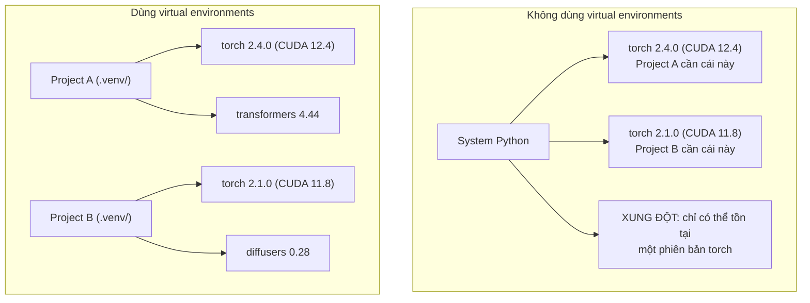

# Python Environments

> Dependency hell là có thật. Virtual environments là cách giải quyết.

- **Type:** Build
- **Languages:** Shell
- **Prerequisites:** Phase 0, Lesson 01
- **Time:** ~30 phút

## Mục tiêu học tập

- Tạo các virtual environment riêng biệt bằng `uv`, `venv`, hoặc `conda`
- Viết file `pyproject.toml` với các nhóm dependency tùy chọn và tạo lockfile để đảm bảo tính tái tạo
- Chẩn đoán và sửa các lỗi thường gặp: cài đặt global, trộn lẫn pip/conda, không khớp phiên bản CUDA
- Áp dụng chiến lược tạo environment riêng cho từng phase trong các dự án có dependency xung đột

## Vấn đề

Bạn cài PyTorch 2.4 cho dự án fine-tuning. Tuần sau, một dự án khác cần PyTorch 2.1 vì bản build CUDA của nó bị pin cố định. Bạn nâng cấp global, dự án đầu tiên hỏng. Bạn hạ cấp, dự án thứ hai hỏng.

Đây là dependency hell. Nó xảy ra liên tục trong công việc AI/ML vì:

- PyTorch, JAX, và TensorFlow đều đi kèm CUDA bindings riêng
- Các thư viện model pin cố định phiên bản framework cụ thể
- Lệnh `pip install` global sẽ ghi đè lên bất kỳ thứ gì đã cài trước đó
- Bản build CUDA 11.8 không hoạt động với driver CUDA 12.x (và ngược lại)

Cách giải quyết: mỗi dự án có environment riêng biệt với các package riêng.

## Khái niệm



## Thực hành

### Cách 1: uv venv (Khuyến nghị)

`uv` là package manager nhanh nhất cho Python (nhanh hơn pip 10-100 lần). Nó xử lý virtual environments, phiên bản Python, và dependency resolution trong một công cụ duy nhất.

```bash
curl -LsSf https://astral.sh/uv/install.sh | sh

uv python install 3.12

cd your-project
uv venv
source .venv/bin/activate
```

Cài package:

```bash
uv pip install torch numpy
```

Tạo project với `pyproject.toml` trong một bước:

```bash
uv init my-ai-project
cd my-ai-project
uv add torch numpy matplotlib
```

### Cách 2: venv (Có sẵn)

Nếu bạn không thể cài `uv`, Python đã có sẵn `venv`:

```bash
python3 -m venv .venv
source .venv/bin/activate  # Linux/macOS
.venv\Scripts\activate     # Windows

pip install torch numpy
```

Chậm hơn `uv`, nhưng hoạt động ở mọi nơi có Python.

### Cách 3: conda (Khi cần thiết)

Conda quản lý cả các dependency không phải Python như CUDA toolkits, cuDNN, và thư viện C. Dùng khi:

- Bạn cần phiên bản CUDA toolkit cụ thể mà không cần cài toàn hệ thống
- Bạn đang dùng cluster chung mà không có quyền cài package hệ thống
- Hướng dẫn cài đặt của thư viện nói "dùng conda"

```bash
# Cài miniconda (không phải Anaconda đầy đủ)
curl -LsSf https://repo.anaconda.com/miniconda/Miniconda3-latest-Linux-x86_64.sh -o miniconda.sh
bash miniconda.sh -b

conda create -n myproject python=3.12
conda activate myproject

conda install pytorch torchvision torchaudio pytorch-cuda=12.4 -c pytorch -c nvidia
```

Một quy tắc: nếu bạn dùng conda cho environment, hãy dùng conda cho tất cả package trong environment đó. Trộn `pip install` vào conda env gây ra xung đột dependency rất khó debug.

### Cho khóa học này: Chiến lược theo Phase

Bạn có thể tạo một environment cho toàn bộ khóa học. Đừng làm vậy. Các phase khác nhau cần các dependency khác nhau (đôi khi xung đột).

Chiến lược:

```
ai-engineering-from-scratch/
├── .venv/                    <-- env nhẹ dùng chung cho phases 0-3
├── phases/
│   ├── 04-neural-networks/
│   │   └── .venv/            <-- PyTorch env
│   ├── 05-cnns/
│   │   └── .venv/            <-- cùng PyTorch env (symlink hoặc dùng chung)
│   ├── 08-transformers/
│   │   └── .venv/            <-- có thể cần phiên bản transformer khác
│   └── 11-llm-apis/
│       └── .venv/            <-- API SDKs, không cần torch
```

Script trong `code/env_setup.sh` tạo environment cơ bản cho khóa học này.

## Cơ bản về pyproject.toml

Mỗi dự án Python nên có file `pyproject.toml`. Nó thay thế `setup.py`, `setup.cfg`, và `requirements.txt` trong một file duy nhất.

```toml
[project]
name = "ai-engineering-from-scratch"
version = "0.1.0"
requires-python = ">=3.11"
dependencies = [
    "numpy>=1.26",
    "matplotlib>=3.8",
    "jupyter>=1.0",
    "scikit-learn>=1.4",
]

[project.optional-dependencies]
torch = ["torch>=2.3", "torchvision>=0.18"]
llm = ["anthropic>=0.39", "openai>=1.50"]
```

Sau đó cài đặt:

```bash
uv pip install -e ".[torch]"    # base + PyTorch
uv pip install -e ".[llm]"     # base + LLM SDKs
uv pip install -e ".[torch,llm]" # tất cả
```

## Lockfiles

Lockfile ghim tất cả dependency (bao gồm transitive dependency) vào phiên bản chính xác. Điều này đảm bảo tính tái tạo: bất kỳ ai cài đặt từ lockfile đều nhận được đúng các package giống nhau.

```bash
# uv tự động tạo uv.lock khi dùng uv add
uv add numpy

# Cách dùng pip-tools
uv pip compile pyproject.toml -o requirements.lock
uv pip install -r requirements.lock
```

Commit lockfile vào git. Khi ai đó clone repo, họ cài đặt từ lockfile và nhận được các phiên bản giống hệt nhau.

## Các lỗi thường gặp

### 1. Cài đặt global

```bash
pip install torch  # TỆ: cài vào System Python

source .venv/bin/activate
pip install torch  # TỐT: cài vào virtual environment
```

Kiểm tra package được cài ở đâu:

```bash
which python       # nên hiện .venv/bin/python, không phải /usr/bin/python
which pip           # nên hiện .venv/bin/pip
```

### 2. Trộn pip và conda

```bash
conda create -n myenv python=3.12
conda activate myenv
conda install pytorch -c pytorch
pip install some-other-package   # TỆ: có thể phá hỏng dependency tracking của conda
conda install some-other-package # TỐT: để conda quản lý mọi thứ
```

Nếu bạn buộc phải dùng pip trong conda (một số package chỉ có trên pip), hãy cài tất cả conda package trước, rồi pip package sau cùng.

### 3. Quên activate

```bash
python train.py           # dùng System Python, thiếu package
source .venv/bin/activate
python train.py           # dùng project Python, tìm thấy package
```

Shell prompt của bạn nên hiển thị tên environment:

```
(.venv) $ python train.py
```

### 4. Commit .venv vào git

```bash
echo ".venv/" >> .gitignore
```

Virtual environments có dung lượng 200MB-2GB. Chúng chỉ dùng cục bộ, không thể di chuyển giữa các máy. Thay vào đó hãy commit `pyproject.toml` và lockfile.

### 5. Không khớp phiên bản CUDA

```bash
nvidia-smi                # hiển thị CUDA version của driver (ví dụ: 12.4)
python -c "import torch; print(torch.version.cuda)"  # hiển thị CUDA version của PyTorch

# Hai phiên bản này phải tương thích.
# CUDA version của PyTorch phải <= CUDA version của driver.
```

## Sử dụng

Chạy script setup để tạo environment cho khóa học:

```bash
bash phases/00-setup-and-tooling/06-python-environments/code/env_setup.sh
```

Lệnh này tạo `.venv` ở thư mục gốc của repo với các dependency cốt lõi đã cài đặt và kiểm tra.

## Bài tập

1. Chạy `env_setup.sh` và xác nhận tất cả các kiểm tra đều pass
2. Tạo virtual environment thứ hai, cài phiên bản numpy khác vào đó, và xác nhận hai environment hoạt động độc lập
3. Viết file `pyproject.toml` cho dự án cần cả PyTorch và Anthropic SDK
4. Cố tình cài package global (không activate venv), quan sát nó được cài ở đâu, sau đó gỡ cài đặt

## Thuật ngữ chính

| Thuật ngữ | Cách nói thường gặp | Ý nghĩa thực sự |
|-----------|---------------------|-----------------|
| Virtual environment | "Một venv" | Thư mục riêng biệt chứa Python interpreter và các package, tách biệt khỏi System Python |
| Lockfile | "Pinned dependencies" | File liệt kê mọi package và phiên bản chính xác, đảm bảo cài đặt giống hệt nhau trên mọi máy |
| pyproject.toml | "setup.py mới" | File cấu hình chuẩn cho dự án Python, thay thế setup.py/setup.cfg/requirements.txt |
| Transitive dependency | "Dependency của dependency" | Package B phụ thuộc C; nếu bạn cài A mà A phụ thuộc B, thì C là transitive dependency của A |
| CUDA mismatch | "GPU không hoạt động" | PyTorch được build cho phiên bản CUDA khác với phiên bản mà driver GPU của bạn hỗ trợ |
