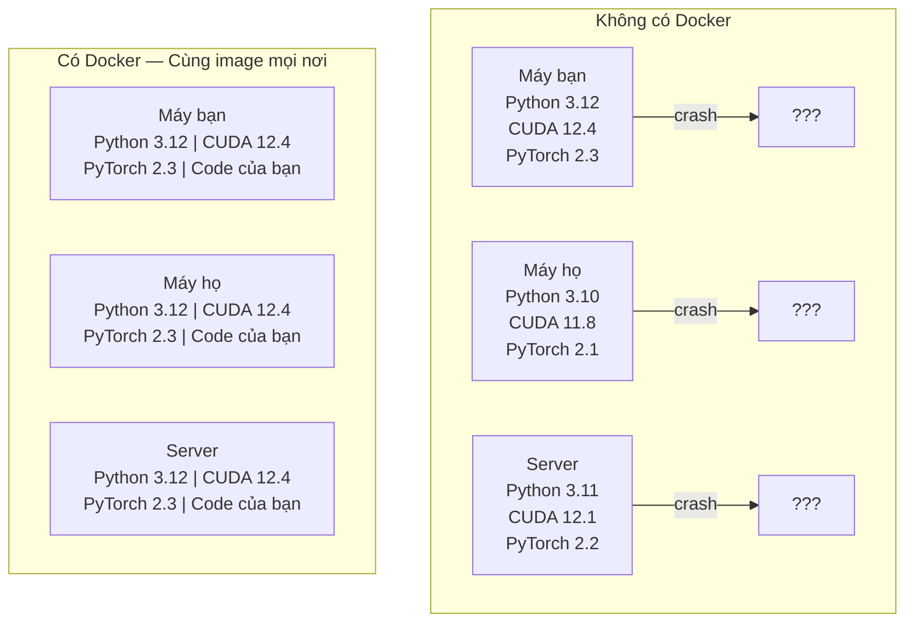

# Docker cho AI

> Container giúp loại bỏ vấn đề "chạy được trên máy tôi" mãi mãi.

**Loại:** Build
**Ngôn ngữ:** Docker
**Yêu cầu trước:** Phase 0, Bài 01 và 03
**Thời gian:** ~60 phút

## Mục tiêu học tập

- Build một Docker image hỗ trợ GPU với CUDA, PyTorch, và các thư viện AI từ một Dockerfile
- Mount thư mục từ máy host làm volume để lưu trữ model, dataset, và code qua các lần rebuild container
- Cấu hình NVIDIA Container Toolkit để cho phép container truy cập GPU
- Điều phối ứng dụng AI nhiều service (inference server + vector database) bằng Docker Compose

## Vấn đề

Bạn train một model trên laptop với PyTorch 2.3, CUDA 12.4, và Python 3.12. Đồng nghiệp của bạn có PyTorch 2.1, CUDA 11.8, và Python 3.10. Model của bạn bị crash trên máy họ. Dockerfile của bạn thì chạy được trên cả hai máy.

Các dự án AI là cơn ác mộng về dependency. Một stack điển hình bao gồm Python, PyTorch, CUDA driver, cuDNN, thư viện C cấp hệ thống, và các package chuyên dụng như flash-attn cần đúng phiên bản compiler. Docker đóng gói tất cả vào một image duy nhất chạy giống hệt nhau ở mọi nơi.

## Khái niệm

Docker gói code, runtime, thư viện, và công cụ hệ thống vào một đơn vị cách ly gọi là container. Hãy hình dung nó giống máy ảo nhẹ, chỉ khác là nó dùng chung kernel của hệ điều hành host thay vì chạy kernel riêng, nên nó khởi động trong vài giây thay vì vài phút.



### Tại sao dự án AI cần Docker hơn hầu hết các dự án khác

1. **GPU driver rất dễ hỏng.** Code CUDA 12.4 không chạy được trên CUDA 11.8. Docker cách ly CUDA toolkit bên trong container trong khi chia sẻ GPU driver của host thông qua NVIDIA Container Toolkit.

2. **Model weight rất lớn.** Một model 7B parameter nặng 14 GB ở fp16. Bạn không muốn tải lại mỗi lần rebuild. Docker volume cho phép bạn mount thư mục model từ host.

3. **Kiến trúc nhiều service rất phổ biến.** Một ứng dụng AI thực tế không chỉ là một script Python. Nó gồm inference server, vector database cho RAG, có thể thêm web frontend. Docker Compose điều phối tất cả chỉ với một lệnh.

### Thuật ngữ chính

| Thuật ngữ | Ý nghĩa |
|-----------|----------|
| Image | Template chỉ đọc. Công thức nấu ăn của bạn. Được build từ Dockerfile. |
| Container | Một instance đang chạy của image. Nhà bếp của bạn. |
| Dockerfile | Hướng dẫn để build image. Từng layer một. |
| Volume | Bộ nhớ lưu trữ bền vững, tồn tại qua các lần restart container. |
| docker-compose | Công cụ để định nghĩa ứng dụng nhiều container bằng YAML. |

### Các pattern container phổ biến trong AI

```
Dev Container
  Bộ công cụ đầy đủ. Hỗ trợ editor. Jupyter. Công cụ debug.
  Dùng trong quá trình phát triển và thử nghiệm.

Training Container
  Tối giản. Chỉ có training script và dependency.
  Chạy trên GPU cluster. Không editor, không Jupyter.

Inference Container
  Tối ưu cho việc phục vụ. Image nhỏ. Khởi động nhanh.
  Chạy phía sau load balancer trên production.
```

## Xây dựng

### Bước 1: Cài đặt Docker

```bash
# macOS
brew install --cask docker
open /Applications/Docker.app

# Ubuntu
curl -fsSL https://get.docker.com | sh
sudo usermod -aG docker $USER
# Đăng xuất và đăng nhập lại để thay đổi group có hiệu lực
```

Kiểm tra:

```bash
docker --version
docker run hello-world
```

### Bước 2: Cài đặt NVIDIA Container Toolkit (Linux có NVIDIA GPU)

Bước này cho phép Docker container truy cập GPU của bạn. Người dùng macOS và Windows (WSL2) có thể bỏ qua; Docker Desktop xử lý GPU passthrough khác nhau trên các nền tảng đó.

```bash
distribution=$(. /etc/os-release;echo $ID$VERSION_ID)
curl -fsSL https://nvidia.github.io/libnvidia-container/gpgkey | sudo gpg --dearmor -o /usr/share/keyrings/nvidia-container-toolkit-keyring.gpg
curl -s -L https://nvidia.github.io/libnvidia-container/$distribution/libnvidia-container.list | \
    sed 's#deb https://#deb [signed-by=/usr/share/keyrings/nvidia-container-toolkit-keyring.gpg] https://#g' | \
    sudo tee /etc/apt/sources.list.d/nvidia-container-toolkit.list

sudo apt-get update
sudo apt-get install -y nvidia-container-toolkit
sudo nvidia-ctk runtime configure --runtime=docker
sudo systemctl restart docker
```

Kiểm tra truy cập GPU bên trong container:

```bash
docker run --rm --gpus all nvidia/cuda:12.4.1-base-ubuntu22.04 nvidia-smi
```

Nếu bạn thấy thông tin GPU, toolkit đã hoạt động.

### Bước 3: Hiểu về base image

Chọn đúng base image giúp tiết kiệm hàng giờ debug.

```
nvidia/cuda:12.4.1-devel-ubuntu22.04
  CUDA toolkit đầy đủ. Có compiler.
  Dùng cho: build các package cần nvcc (flash-attn, bitsandbytes)
  Kích thước: ~4 GB

nvidia/cuda:12.4.1-runtime-ubuntu22.04
  Chỉ có CUDA runtime. Không có compiler.
  Dùng cho: chạy code đã build sẵn
  Kích thước: ~1.5 GB

pytorch/pytorch:2.3.1-cuda12.4-cudnn9-runtime
  PyTorch đã cài sẵn trên CUDA.
  Dùng cho: bỏ qua bước cài PyTorch
  Kích thước: ~6 GB

python:3.12-slim
  Không có CUDA. Chỉ CPU.
  Dùng cho: inference trên CPU, công cụ nhẹ
  Kích thước: ~150 MB
```

### Bước 4: Viết Dockerfile cho phát triển AI

Đây là Dockerfile trong `code/Dockerfile`. Hãy đi qua từng phần:

```dockerfile
FROM nvidia/cuda:12.4.1-devel-ubuntu22.04

ENV DEBIAN_FRONTEND=noninteractive
ENV PYTHONUNBUFFERED=1

RUN apt-get update && apt-get install -y --no-install-recommends \
    python3.12 \
    python3.12-venv \
    python3.12-dev \
    python3-pip \
    git \
    curl \
    build-essential \
    && rm -rf /var/lib/apt/lists/*

RUN update-alternatives --install /usr/bin/python python /usr/bin/python3.12 1

RUN python -m pip install --no-cache-dir --upgrade pip setuptools wheel

RUN python -m pip install --no-cache-dir \
    torch==2.3.1 \
    torchvision==0.18.1 \
    torchaudio==2.3.1 \
    --index-url https://download.pytorch.org/whl/cu124

RUN python -m pip install --no-cache-dir \
    numpy \
    pandas \
    scikit-learn \
    matplotlib \
    jupyter \
    transformers \
    datasets \
    accelerate \
    safetensors

WORKDIR /workspace

VOLUME ["/workspace", "/models"]

EXPOSE 8888

CMD ["python"]
```

Build image:

```bash
docker build -t ai-dev -f phases/00-setup-and-tooling/07-docker-for-ai/code/Dockerfile .
```

Lần đầu sẽ mất khá lâu (tải CUDA base image + PyTorch). Các lần build sau sẽ dùng cached layer nên nhanh hơn.

Chạy container:

```bash
docker run --rm -it --gpus all \
    -v $(pwd):/workspace \
    -v ~/models:/models \
    ai-dev python -c "import torch; print(f'PyTorch {torch.__version__}, CUDA: {torch.cuda.is_available()}')"
```

Chạy Jupyter bên trong container:

```bash
docker run --rm -it --gpus all \
    -v $(pwd):/workspace \
    -v ~/models:/models \
    -p 8888:8888 \
    ai-dev jupyter notebook --ip=0.0.0.0 --port=8888 --no-browser --allow-root
```

### Bước 5: Volume mount cho data và model

Volume mount rất quan trọng cho công việc AI. Nếu không có chúng, 14 GB model bạn tải về sẽ biến mất khi container dừng.

```bash
# Mount code của bạn
-v $(pwd):/workspace

# Mount thư mục model dùng chung
-v ~/models:/models

# Mount dataset
-v ~/datasets:/data
```

Trong training script, load từ đường dẫn đã mount:

```python
from transformers import AutoModel

model = AutoModel.from_pretrained("/models/llama-7b")
```

Model nằm trên filesystem của host. Rebuild container bao nhiêu lần tùy thích mà không cần tải lại.

### Bước 6: Docker Compose cho ứng dụng AI nhiều service

Một ứng dụng RAG thực tế cần inference server và vector database. Docker Compose chạy cả hai chỉ với một lệnh.

Xem `code/docker-compose.yml`:

```yaml
services:
  ai-dev:
    build:
      context: .
      dockerfile: Dockerfile
    deploy:
      resources:
        reservations:
          devices:
            - driver: nvidia
              count: all
              capabilities: [gpu]
    volumes:
      - ../../../:/workspace
      - ~/models:/models
      - ~/datasets:/data
    ports:
      - "8888:8888"
    stdin_open: true
    tty: true
    command: jupyter notebook --ip=0.0.0.0 --port=8888 --no-browser --allow-root

  qdrant:
    image: qdrant/qdrant:v1.12.5
    ports:
      - "6333:6333"
      - "6334:6334"
    volumes:
      - qdrant_data:/qdrant/storage

volumes:
  qdrant_data:
```

Khởi động tất cả:

```bash
cd phases/00-setup-and-tooling/07-docker-for-ai/code
docker compose up -d
```

Bây giờ container AI dev của bạn có thể kết nối đến vector database tại `http://qdrant:6333` bằng tên service. Docker Compose tự động tạo mạng chung.

Kiểm tra kết nối từ bên trong container AI:

```python
from qdrant_client import QdrantClient

client = QdrantClient(host="qdrant", port=6333)
print(client.get_collections())
```

Dừng tất cả:

```bash
docker compose down
```

Thêm `-v` để xóa luôn qdrant volume:

```bash
docker compose down -v
```

### Bước 7: Các lệnh Docker hữu ích cho công việc AI

```bash
# Liệt kê các container đang chạy
docker ps

# Liệt kê tất cả image và kích thước
docker images

# Xóa image không dùng (giải phóng dung lượng ổ đĩa)
docker system prune -a

# Kiểm tra GPU bên trong container đang chạy
docker exec -it <container_id> nvidia-smi

# Sao chép file từ container ra host
docker cp <container_id>:/workspace/results.csv ./results.csv

# Xem log của container
docker logs -f <container_id>
```

## Sử dụng

Bạn đã có môi trường phát triển AI có thể tái tạo. Trong phần còn lại của khóa học:

- Dùng `docker compose up` để khởi động môi trường dev và vector database cùng lúc
- Mount code, model, và data làm volume để không mất gì giữa các lần rebuild
- Khi một bài học cần package Python mới, thêm nó vào Dockerfile và rebuild
- Chia sẻ Dockerfile với đồng đội. Họ sẽ có cùng môi trường y hệt.

### Không có GPU?

Bỏ flag `--gpus all` và block NVIDIA deploy. Container vẫn hoạt động cho các bài học dùng CPU. PyTorch phát hiện không có CUDA và tự động chuyển sang CPU.

## Bài tập

1. Build Dockerfile và chạy `python -c "import torch; print(torch.__version__)"` bên trong container
2. Khởi động docker-compose stack và kiểm tra Qdrant có thể truy cập từ container AI tại `http://qdrant:6333/collections`
3. Thêm `flask` vào Dockerfile, rebuild, và chạy một API server đơn giản trên port 5000. Map port với `-p 5000:5000`
4. Đo kích thước image với `docker images`. Thử đổi base image từ `devel` sang `runtime` và so sánh kích thước

## Thuật ngữ chính

| Thuật ngữ | Cách mọi người hay gọi | Ý nghĩa thực sự |
|-----------|------------------------|------------------|
| Container | "VM nhẹ" | Một process cách ly dùng kernel của host, có filesystem và network riêng |
| Image layer | "Bước đã cache" | Mỗi lệnh trong Dockerfile tạo một layer. Layer không thay đổi sẽ được cache, nên rebuild rất nhanh. |
| NVIDIA Container Toolkit | "GPU trong Docker" | Một runtime hook cho phép container truy cập GPU của host qua flag `--gpus` |
| Volume mount | "Thư mục dùng chung" | Thư mục trên host được ánh xạ vào container. Thay đổi vẫn được giữ sau khi container dừng. |
| Base image | "Điểm khởi đầu" | Image `FROM` mà Dockerfile build trên đó. Quyết định những gì được cài sẵn. |
