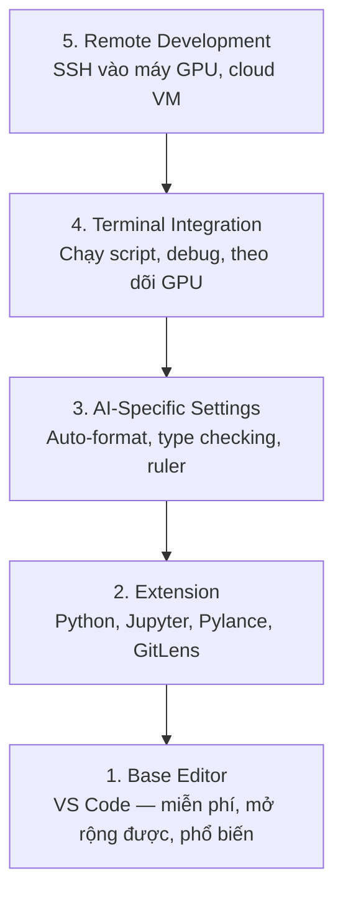

# Cài đặt Editor

> Editor là phụ tá của bạn. Cấu hình một lần để nó không cản đường và bắt đầu hỗ trợ bạn.

- **Loại:** Build
- **Ngôn ngữ:** --
- **Yêu cầu trước:** Phase 0, Bài 01
- **Thời gian:** ~20 phút

## Mục tiêu học tập

- Cài đặt VS Code với các extension cần thiết cho Python, Jupyter, linting, và remote SSH
- Cấu hình format-on-save, type checking, và notebook output scrolling cho quy trình làm việc AI
- Thiết lập Remote SSH để chỉnh sửa và debug code trên máy GPU từ xa như thể đang làm việc trên máy local
- Đánh giá các editor thay thế (Cursor, Windsurf, Neovim) và ưu nhược điểm của chúng cho công việc AI

## Vấn đề

Bạn sẽ dành hàng ngàn giờ trong editor để viết Python, chạy notebook, debug training loop, và SSH vào các máy GPU. Một editor cấu hình sai biến mỗi phiên làm việc thành khó chịu: không có autocomplete, không có type hint, không có inline error, phải format thủ công, và quy trình terminal lộn xộn.

Cài đặt đúng mất 20 phút. Bỏ qua nó tốn bạn 20 phút mỗi ngày.

## Khái niệm

Một editor cho AI engineering cần năm thứ:



## Xây dựng

### Bước 1: Cài đặt VS Code

VS Code là editor được khuyến nghị. Nó miễn phí, chạy trên mọi hệ điều hành, hỗ trợ Jupyter notebook hạng nhất, và hệ sinh thái extension bao phủ mọi thứ bạn cần cho công việc AI.

Tải về từ [code.visualstudio.com](https://code.visualstudio.com/).

Kiểm tra từ terminal:

```bash
code --version
```

Nếu `code` không tìm thấy trên macOS, mở VS Code, nhấn `Cmd+Shift+P`, gõ "Shell Command", và chọn "Install 'code' command in PATH".

### Bước 2: Cài đặt các Extension cần thiết

Mở integrated terminal trong VS Code (`Ctrl+`` ` hoặc `` Cmd+` ``) và cài các extension quan trọng cho công việc AI:

```bash
code --install-extension ms-python.python
code --install-extension ms-python.vscode-pylance
code --install-extension ms-toolsai.jupyter
code --install-extension eamodio.gitlens
code --install-extension ms-vscode-remote.remote-ssh
code --install-extension ms-python.debugpy
code --install-extension ms-python.black-formatter
code --install-extension charliermarsh.ruff
```

Chức năng của từng extension:

| Extension | Tại sao cần |
|-----------|-------------|
| Python | Hỗ trợ ngôn ngữ, phát hiện virtual env, chạy/debug |
| Pylance | Type checking nhanh, autocomplete, giải quyết import |
| Jupyter | Chạy notebook trong VS Code, variable explorer |
| GitLens | Xem ai thay đổi gì, inline git blame |
| Remote SSH | Mở thư mục trên máy GPU từ xa như thể local |
| Debugpy | Debug từng bước cho Python |
| Black Formatter | Tự động format khi save, style nhất quán |
| Ruff | Linting nhanh, bắt lỗi phổ biến |

File `code/.vscode/extensions.json` trong bài học này chứa danh sách đầy đủ các extension được khuyến nghị. Khi bạn mở thư mục dự án, VS Code sẽ nhắc bạn cài đặt chúng.

### Bước 3: Cấu hình Settings

Sao chép settings từ `code/.vscode/settings.json` trong bài học này, hoặc áp dụng thủ công qua `Settings > Open Settings (JSON)`.

Các setting quan trọng cho công việc AI:

```jsonc
{
    "python.analysis.typeCheckingMode": "basic",
    "editor.formatOnSave": true,
    "editor.rulers": [88, 120],
    "notebook.output.scrolling": true,
    "files.autoSave": "afterDelay"
}
```

Tại sao chúng quan trọng:

- **Type checking ở mức basic**: Bắt lỗi sai kiểu tham số trước khi bạn chạy. Tiết kiệm thời gian debug lỗi tensor shape và API parameter sai.
- **Format on save**: Không bao giờ phải nghĩ về formatting nữa. Black lo hết.
- **Ruler ở 88 và 120**: Black xuống dòng ở 88. Dấu 120 cho thấy khi docstring và comment quá dài.
- **Notebook output scrolling**: Training loop in ra hàng ngàn dòng. Không có scrolling, bảng output sẽ bùng nổ.
- **Auto-save**: Bạn sẽ quên lưu. Training script sẽ chạy code cũ. Auto-save ngăn chặn điều đó.

### Bước 4: Terminal Integration

Integrated terminal của VS Code là nơi bạn chạy training script, theo dõi GPU, và quản lý environment.

Thiết lập đúng cách:

```jsonc
{
    "terminal.integrated.defaultProfile.osx": "zsh",
    "terminal.integrated.defaultProfile.linux": "bash",
    "terminal.integrated.fontSize": 13,
    "terminal.integrated.scrollback": 10000
}
```

Phím tắt hữu ích:

| Hành động | macOS | Linux/Windows |
|-----------|-------|---------------|
| Bật/tắt terminal | `` Ctrl+` `` | `` Ctrl+` `` |
| Terminal mới | `Ctrl+Shift+`` ` | `Ctrl+Shift+`` ` |
| Chia terminal | `Cmd+\` | `Ctrl+\` |

Chia terminal rất hữu ích: một cái để chạy script, một cái để theo dõi GPU với `nvidia-smi -l 1` hoặc `watch -n 1 nvidia-smi`.

### Bước 5: Remote Development (SSH vào máy GPU)

Đây là extension quan trọng nhất cho công việc AI. Bạn sẽ chạy training trên máy từ xa (cloud VM, server phòng lab, Lambda, Vast.ai). Remote SSH cho phép bạn mở filesystem từ xa, chỉnh sửa file, chạy terminal, và debug như thể mọi thứ đều ở local.

Thiết lập:

1. Cài extension Remote SSH (đã làm ở Bước 2).
2. Nhấn `Ctrl+Shift+P` (hoặc `Cmd+Shift+P`), gõ "Remote-SSH: Connect to Host".
3. Nhập `user@your-gpu-box-ip`.
4. VS Code tự động cài server component trên máy từ xa.

Để truy cập không cần mật khẩu, thiết lập SSH key:

```bash
ssh-keygen -t ed25519 -C "your-email@example.com"
ssh-copy-id user@your-gpu-box-ip
```

Thêm host vào `~/.ssh/config` cho tiện:

```
Host gpu-box
    HostName 203.0.113.50
    User ubuntu
    IdentityFile ~/.ssh/id_ed25519
    ForwardAgent yes
```

Bây giờ `Remote-SSH: Connect to Host > gpu-box` kết nối ngay lập tức.

## Các lựa chọn thay thế

### Cursor

[cursor.com](https://cursor.com) là bản fork của VS Code với tính năng AI code generation tích hợp sẵn. Nó dùng cùng hệ sinh thái extension và định dạng settings. Nếu bạn dùng Cursor, mọi thứ trong bài học này vẫn áp dụng được. Import cùng `settings.json` và `extensions.json`.

### Windsurf

[windsurf.com](https://windsurf.com) là một bản fork VS Code khác ưu tiên AI. Tương tự: cùng extension, cùng định dạng settings, cùng hỗ trợ Remote SSH.

### Vim/Neovim

Nếu bạn đã dùng Vim hoặc Neovim và làm việc hiệu quả với nó, hãy tiếp tục. Cài đặt tối thiểu cho công việc AI Python:

- **pyright** hoặc **pylsp** cho type checking (qua Mason hoặc cài thủ công)
- **nvim-lspconfig** cho tích hợp language server
- **jupyter-vim** hoặc **molten-nvim** để chạy code kiểu notebook
- **telescope.nvim** để tìm file/symbol
- **none-ls.nvim** với black và ruff cho formatting/linting

Nếu bạn chưa dùng Vim, đừng bắt đầu bây giờ. Đường cong học tập sẽ cạnh tranh với việc học AI engineering. Hãy dùng VS Code.

## Sử dụng

Với thiết lập này, quy trình làm việc hàng ngày của bạn sẽ như sau:

1. Mở thư mục dự án trong VS Code (hoặc kết nối qua Remote SSH đến máy GPU).
2. Viết Python trong editor với autocomplete, type hint, và inline error.
3. Chạy Jupyter notebook ngay trong VS Code với Jupyter extension.
4. Dùng integrated terminal để chạy training script, `uv pip install`, và theo dõi GPU.
5. Xem lại thay đổi với GitLens trước khi commit.

## Bài tập

1. Cài VS Code và tất cả extension liệt kê ở Bước 2
2. Sao chép `settings.json` từ bài học này vào cấu hình VS Code của bạn
3. Mở một file Python và kiểm tra Pylance hiển thị type hint và Black format khi save
4. Nếu bạn có quyền truy cập máy từ xa, thiết lập Remote SSH và mở một thư mục trên đó

## Thuật ngữ chính

| Thuật ngữ | Cách mọi người hay gọi | Ý nghĩa thực sự |
|-----------|------------------------|------------------|
| LSP | "Autocomplete engine" | Language Server Protocol: chuẩn giao tiếp để editor nhận type info, completion, và diagnostic từ một language server chuyên biệt |
| Pylance | "Python plugin" | Language server Python của Microsoft dùng Pyright cho type checking và IntelliSense |
| Remote SSH | "Làm việc trên server" | Extension VS Code chạy một server nhẹ trên máy từ xa và stream giao diện về editor local |
| Format on save | "Auto-prettier" | Editor chạy formatter (Black, Ruff) mỗi lần bạn save, nên code style luôn nhất quán |
