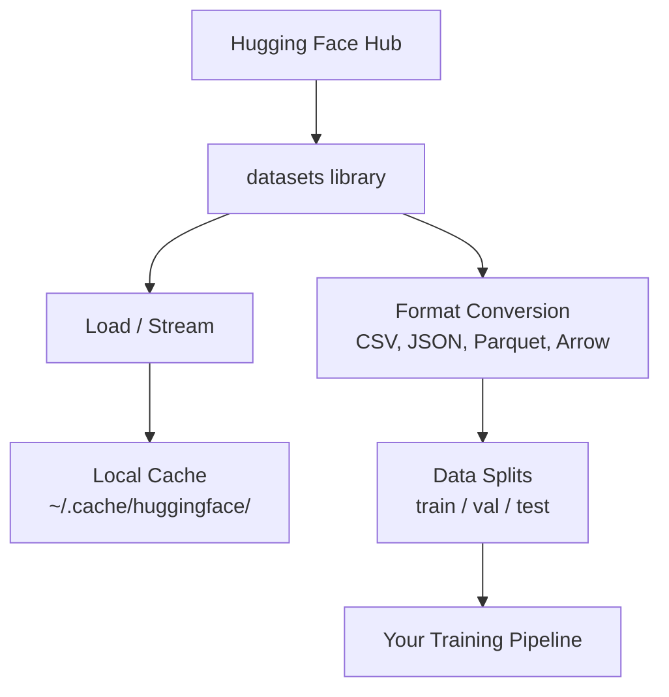

# Data Management

> Data là nhiên liệu. Cách bạn quản lý nó quyết định tốc độ bạn đi.

- **Type:** Build
- **Language:** Python
- **Prerequisites:** Phase 0, Lesson 01
- **Time:** ~45 phút

## Mục Tiêu Học Tập

- Load, stream, và cache dataset sử dụng thư viện Hugging Face `datasets`
- Chuyển đổi giữa các format CSV, JSON, Parquet, và Arrow và giải thích ưu nhược điểm của chúng
- Tạo các data split train/validation/test có thể tái tạo với random seed cố định
- Quản lý các file model và dataset lớn sử dụng `.gitignore`, Git LFS, hoặc DVC

## Vấn Đề

Mỗi dự án AI đều bắt đầu với data. Bạn cần tìm dataset, download chúng, chuyển đổi giữa các format, chia chúng cho training và evaluation, và version chúng để các thí nghiệm có thể tái tạo. Làm thủ công mỗi lần rất chậm và dễ sai. Bạn cần một workflow lặp lại được.

## Khái Niệm



Thư viện Hugging Face `datasets` là cách chuẩn để load data cho công việc AI. Nó xử lý việc download, caching, chuyển đổi format, và streaming ngay từ đầu.

## Xây Dựng

### Bước 1: Cài đặt thư viện datasets

```bash
pip install datasets huggingface_hub
```

### Bước 2: Load một dataset

```python
from datasets import load_dataset

dataset = load_dataset("imdb")
print(dataset)
print(dataset["train"][0])
```

Lệnh này download dataset đánh giá phim IMDB. Sau lần download đầu tiên, nó load từ cache tại `~/.cache/huggingface/datasets/`.

### Bước 3: Stream dataset lớn

Một số dataset quá lớn để chứa trên ổ đĩa. Streaming load chúng từng dòng một mà không cần download toàn bộ.

```python
dataset = load_dataset("wikimedia/wikipedia", "20220301.en", split="train", streaming=True)

for i, example in enumerate(dataset):
    print(example["title"])
    if i >= 4:
        break
```

Streaming cho bạn một `IterableDataset`. Bạn xử lý các dòng khi chúng đến. Bộ nhớ sử dụng không đổi bất kể kích thước dataset.

### Bước 4: Các format của Dataset

Thư viện `datasets` sử dụng Apache Arrow bên trong. Bạn có thể chuyển đổi sang các format khác tùy theo nhu cầu của pipeline.

```python
dataset = load_dataset("imdb", split="train")

dataset.to_csv("imdb_train.csv")
dataset.to_json("imdb_train.json")
dataset.to_parquet("imdb_train.parquet")
```

So sánh các format:

| Format | Size | Read Speed | Phù Hợp Cho |
|--------|------|-----------|------------|
| CSV | Lớn | Chậm | Dễ đọc cho người, spreadsheet |
| JSON | Lớn | Chậm | API, dữ liệu lồng nhau |
| Parquet | Nhỏ | Nhanh | Phân tích, truy vấn theo cột |
| Arrow | Nhỏ | Nhanh nhất | Xử lý trong bộ nhớ (thư viện `datasets` dùng bên trong) |

Cho công việc AI, Parquet là format lưu trữ tốt nhất. Arrow là cái bạn dùng trong bộ nhớ. CSV và JSON dùng để trao đổi dữ liệu.

### Bước 5: Data split

Mỗi dự án ML cần ba split:

- **Train**: Model học từ phần này (thường 80%)
- **Validation**: Bạn kiểm tra tiến trình trong quá trình training (thường 10%)
- **Test**: Đánh giá cuối cùng sau khi training xong (thường 10%)

Một số dataset đã được split sẵn. Khi chưa có, tự split chúng:

```python
dataset = load_dataset("imdb", split="train")

split = dataset.train_test_split(test_size=0.2, seed=42)
train_val = split["train"].train_test_split(test_size=0.125, seed=42)

train_ds = train_val["train"]
val_ds = train_val["test"]
test_ds = split["test"]

print(f"Train: {len(train_ds)}, Val: {len(val_ds)}, Test: {len(test_ds)}")
```

Luôn đặt seed để đảm bảo tái tạo được. Cùng seed sẽ cho cùng split mỗi lần.

### Bước 6: Download và cache model

Model là các file lớn. Thư viện `huggingface_hub` xử lý việc download và caching.

```python
from huggingface_hub import hf_hub_download, snapshot_download

model_path = hf_hub_download(
    repo_id="sentence-transformers/all-MiniLM-L6-v2",
    filename="config.json"
)
print(f"Cached at: {model_path}")

model_dir = snapshot_download("sentence-transformers/all-MiniLM-L6-v2")
print(f"Full model at: {model_dir}")
```

Model được cache tại `~/.cache/huggingface/hub/`. Sau khi download, chúng load ngay lập tức ở các lần chạy sau.

### Bước 7: Xử lý file lớn

Model weight và dataset lớn không nên đưa vào git. Ba lựa chọn:

**Lựa chọn A: .gitignore (đơn giản nhất)**

```
*.bin
*.safetensors
*.pt
*.onnx
data/*.parquet
data/*.csv
models/
```

**Lựa chọn B: Git LFS (theo dõi file lớn trong git)**

```bash
git lfs install
git lfs track "*.bin"
git lfs track "*.safetensors"
git add .gitattributes
```

Git LFS lưu pointer trong repo và file thực tế trên server riêng. GitHub cho bạn 1 GB miễn phí.

**Lựa chọn C: DVC (data version control)**

```bash
pip install dvc
dvc init
dvc add data/training_set.parquet
git add data/training_set.parquet.dvc data/.gitignore
git commit -m "Track training data with DVC"
```

DVC tạo các file `.dvc` nhỏ trỏ đến data của bạn. Data thực tế nằm trên S3, GCS, hoặc backend lưu trữ từ xa khác.

| Cách tiếp cận | Độ phức tạp | Phù Hợp Cho |
|----------------|-------------|------------|
| .gitignore | Thấp | Dự án cá nhân, data đã download có thể tải lại |
| Git LFS | Trung bình | Team chia sẻ model weight qua git |
| DVC | Cao | Thí nghiệm tái tạo được, dataset lớn, làm việc nhóm |

Cho khóa học này, `.gitignore` là đủ. Dùng DVC khi bạn cần tái tạo chính xác các thí nghiệm trên nhiều máy.

### Bước 8: Các pattern lưu trữ

**Local storage** phù hợp cho dataset dưới ~10 GB. HF cache xử lý việc này tự động.

**Cloud storage** dành cho mọi thứ lớn hơn hoặc chia sẻ giữa nhiều máy:

```python
import os

local_path = os.path.expanduser("~/.cache/huggingface/datasets/")

# s3_path = "s3://my-bucket/datasets/"
# gcs_path = "gs://my-bucket/datasets/"
```

DVC tích hợp trực tiếp với S3 và GCS:

```bash
dvc remote add -d myremote s3://my-bucket/dvc-store
dvc push
```

Cho khóa học này, local storage là đủ. Cloud storage trở nên cần thiết khi bạn fine-tune trên các GPU instance từ xa.

## Dataset Dùng Trong Khóa Học

| Dataset | Bài học | Size | Dạy Về |
|---------|---------|------|--------|
| IMDB | Tokenization, classification | 84 MB | Cơ bản text classification |
| WikiText | Language modeling | 181 MB | Dự đoán next-token |
| SQuAD | Hệ thống QA | 35 MB | Question answering, span |
| Common Crawl (subset) | Embedding | Khác nhau | Xử lý text quy mô lớn |
| MNIST | Cơ bản vision | 21 MB | Cơ bản image classification |
| COCO (subset) | Multimodal | Khác nhau | Cặp image-text |

Bạn không cần download tất cả ngay bây giờ. Mỗi bài học sẽ chỉ rõ cần gì.

## Sử Dụng

Chạy script tiện ích để kiểm tra mọi thứ hoạt động:

```bash
python code/data_utils.py
```

Lệnh này download một dataset nhỏ, chuyển đổi format, split nó, và in ra tóm tắt.

## Kết Quả

Bài học này tạo ra:
- `code/data_utils.py` - tiện ích load và cache data có thể tái sử dụng
- `outputs/prompt-data-helper.md` - prompt để tìm dataset phù hợp cho một tác vụ

## Bài Tập

1. Load dataset `glue` với config `mrpc` và xem 5 example đầu tiên
2. Stream dataset `c4` và đếm xem bạn xử lý được bao nhiêu example trong 10 giây
3. Chuyển một dataset sang Parquet và so sánh kích thước file với CSV
4. Tạo split train/val/test tỉ lệ 70/15/15 với seed cố định và kiểm tra kích thước

## Thuật Ngữ Chính

| Thuật ngữ     | Người ta hay nói     | Ý nghĩa thực sự                                                                                    |
| ------------- | -------------------- | --------------------------------------------------------------------------------------------------- |
| Dataset split | "Training data"      | Một tập con được đặt tên (train/val/test) dùng ở các giai đoạn khác nhau của vòng đời ML           |
| Streaming     | "Load kiểu lazy"     | Xử lý data từng dòng từ nguồn từ xa mà không download toàn bộ dataset                              |
| Parquet       | "CSV nén"            | Format file dạng cột tối ưu cho truy vấn phân tích và hiệu quả lưu trữ                            |
| Arrow         | "Dataframe nhanh"    | Format dạng cột trong bộ nhớ được thư viện datasets dùng bên trong cho zero-copy read               |
| Git LFS       | "Git cho file lớn"   | Extension lưu file lớn ngoài git repo trong khi giữ pointer trong version control                   |
| DVC           | "Git cho data"       | Hệ thống version control cho dataset và model tích hợp với cloud storage                            |
| Cache         | "Đã download rồi"   | Bản sao local của data đã tải trước đó, mặc định lưu tại ~/.cache/huggingface/                     |
