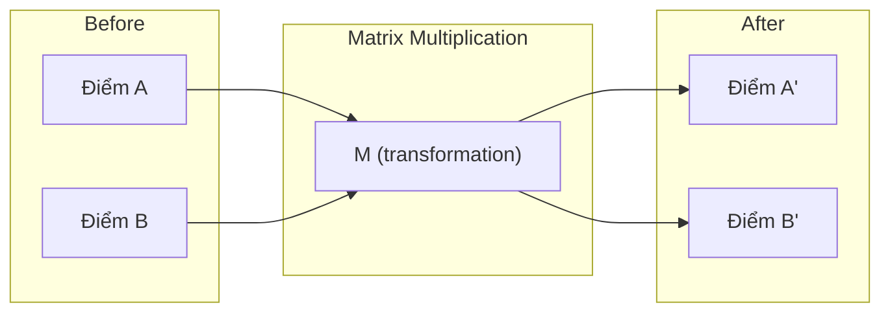
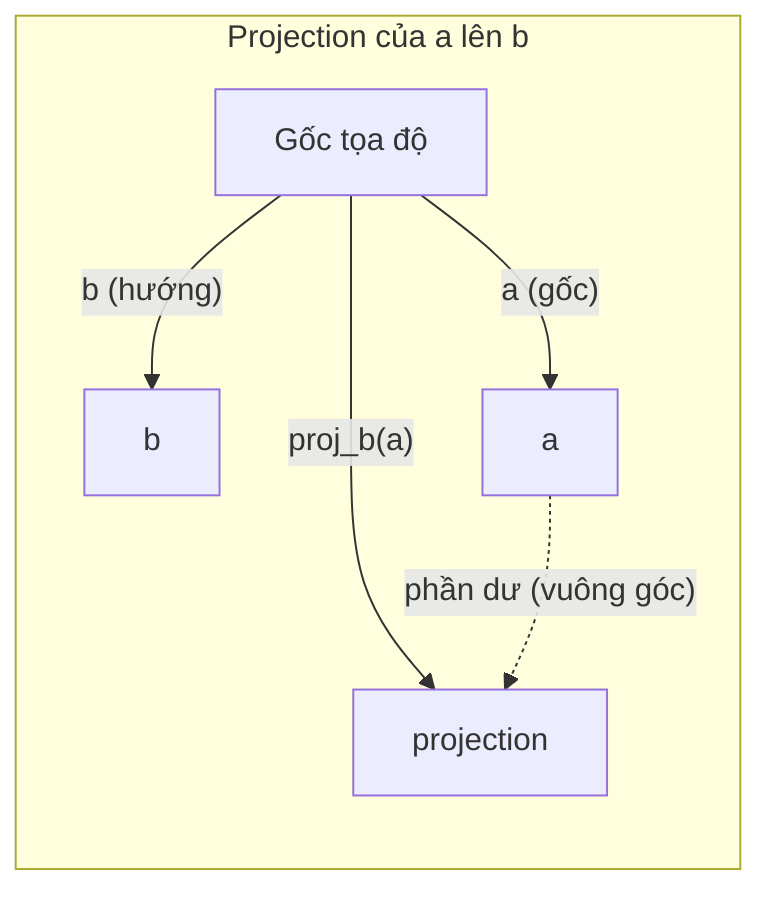

# Linear Algebra Intuition

> Mọi AI model chỉ là phép toán matrix đội một cái mũ sang chảnh.

- **Loại:** Học lý thuyết
- **Ngôn ngữ:** Python, Julia
- **Yêu cầu trước:** Phase 0
- **Thời gian:** ~60 phút

## Mục tiêu học tập

- Tự viết các phép toán vector và matrix (cộng, dot product, nhân matrix) từ đầu bằng Python
- Giải thích được ý nghĩa hình học của dot product, projection, và Gram-Schmidt process
- Xác định linear independence, rank, và basis của một tập vector bằng row reduction
- Kết nối các khái niệm linear algebra với ứng dụng AI: embeddings, attention scores, và LoRA

## Vấn đề

Mở bất kỳ bài báo ML nào. Ngay trang đầu, bạn sẽ thấy vectors, matrices, dot products, và transformations. Nếu không có trực giác về linear algebra, đây chỉ là những ký hiệu vô nghĩa. Nhưng nếu hiểu, bạn có thể nhìn thấy neural network đang thực sự làm gì -- di chuyển các điểm trong không gian.

Bạn không cần phải là nhà toán học. Bạn cần nhìn thấy các phép toán này có ý nghĩa gì về mặt hình học, rồi tự code chúng.

## Khái niệm

### Vectors là các điểm (và hướng)

Một vector chỉ là một danh sách các số. Nhưng những con số đó có ý nghĩa -- chúng là tọa độ trong không gian.

**Vector 2D [3, 2]:**

| x | y | Điểm |
|---|---|------|
| 3 | 2 | Vector chỉ từ gốc tọa độ (0,0) đến (3, 2) trên mặt phẳng |

Vector có magnitude sqrt(3^2 + 2^2) = sqrt(13) và chỉ lên trên bên phải.

Trong AI, vectors đại diện cho mọi thứ:
- Một từ → một vector gồm 768 số (nghĩa của nó trong embedding space)
- Một ảnh → một vector gồm hàng triệu pixel values
- Một người dùng → một vector các sở thích

### Matrices là các phép biến đổi

Một matrix biến đổi vector này thành vector khác. Nó có thể xoay, co giãn, kéo dài, hoặc chiếu.



Trong AI, matrices CHÍNH LÀ model:
- Trọng số neural network → matrices biến đổi input thành output
- Attention scores → matrices quyết định tập trung vào đâu
- Embeddings → matrices ánh xạ từ thành vectors

### Dot Product đo độ tương tự

Dot product của hai vectors cho biết chúng giống nhau đến mức nào.

```
a · b = a₁×b₁ + a₂×b₂ + ... + aₙ×bₙ

Cùng hướng:       a · b > 0  (tương tự)
Vuông góc:         a · b = 0  (không liên quan)
Ngược hướng:       a · b < 0  (khác biệt)
```

Đây đúng là cách search engines, recommendation systems, và RAG hoạt động -- tìm vectors có dot products cao.

<video src="DotProductIntuition.mp4" controls="controls" style="max-width: 100%;">
</video>


### Linear Independence

Các vectors là linearly independent nếu không có vector nào trong tập có thể viết dưới dạng tổ hợp của các vector còn lại. Nếu v1, v2, v3 là independent, chúng trải ra một không gian 3D. Nếu một vector là tổ hợp của các vector khác, chúng chỉ trải ra một mặt phẳng.

Tại sao quan trọng trong AI: feature matrix của bạn nên có các cột linearly independent. Nếu hai features hoàn toàn tương quan (linearly dependent), model không thể phân biệt được ảnh hưởng của chúng. Điều này gây ra multicollinearity trong regression -- weight matrix trở nên bất ổn, và thay đổi nhỏ ở input tạo ra dao động lớn ở output.

**Ví dụ cụ thể:**

```
v1 = [1, 0, 0]
v2 = [0, 1, 0]
v3 = [2, 1, 0]   # v3 = 2*v1 + v2
```

v1 và v2 là independent -- không cái nào là bội số hoặc tổ hợp của cái kia. Nhưng v3 = 2*v1 + v2, nên {v1, v2, v3} là tập dependent. Ba vectors này đều nằm trong mặt phẳng xy. Dù kết hợp thế nào, bạn cũng không thể đạt đến [0, 0, 1]. Bạn có ba vectors nhưng chỉ có hai chiều tự do.

Trong dataset: nếu feature_3 = 2*feature_1 + feature_2, thêm feature_3 không cho model thông tin mới nào. Tệ hơn, nó làm normal equations trở nên singular -- không có nghiệm duy nhất cho weights.

### Basis và Rank

Basis là tập tối thiểu các vectors linearly independent mà trải ra toàn bộ không gian. Số lượng basis vectors chính là dimension của không gian đó.

Standard basis cho không gian 3D là {[1,0,0], [0,1,0], [0,0,1]}. Nhưng bất kỳ ba vectors independent nào trong 3D đều tạo thành một basis hợp lệ. Việc chọn basis là chọn hệ tọa độ.

Rank của matrix = số cột linearly independent = số hàng linearly independent. Nếu rank < min(rows, cols), matrix bị rank-deficient. Điều này có nghĩa:
- Hệ phương trình có vô số nghiệm (hoặc không có)
- Thông tin bị mất trong quá trình biến đổi
- Matrix không thể invert được

| Tình huống | Rank | Ý nghĩa trong ML |
|------------|------|-------------------|
| Full rank (rank = min(m, n)) | Lớn nhất có thể | Nghiệm least-squares duy nhất tồn tại. Model hoạt động ổn định. |
| Rank deficient (rank < min(m, n)) | Dưới mức tối đa | Features thừa. Vô số nghiệm cho weights. Cần regularization. |
| Rank 1 | 1 | Mỗi cột là bản sao co giãn của một vector. Toàn bộ dữ liệu nằm trên một đường thẳng. |
| Near rank-deficient (singular values nhỏ) | Thấp về mặt số học | Matrix bị ill-conditioned. Nhiễu nhỏ ở input gây thay đổi lớn ở output. Dùng SVD truncation hoặc ridge regression. |

### Projection

Chiếu vector **a** lên vector **b** cho ta thành phần của **a** theo hướng **b**:

```
proj_b(a) = (a dot b / b dot b) * b
```

Phần dư (a - proj_b(a)) vuông góc với b. Phân tích trực giao này là nền tảng của least-squares fitting.

Projection xuất hiện khắp nơi trong ML:
- Linear regression tối thiểu khoảng cách từ các quan sát đến column space -- nghiệm CHÍNH LÀ một projection
- PCA chiếu dữ liệu lên các hướng có variance lớn nhất
- Attention trong transformers tính projections của queries lên keys



**Ví dụ:** a = [3, 4], b = [1, 0]

proj_b(a) = (3*1 + 4*0) / (1*1 + 0*0) * [1, 0] = 3 * [1, 0] = [3, 0]

Projection loại bỏ thành phần y. Đây là dimensionality reduction ở dạng đơn giản nhất -- bỏ đi những hướng bạn không quan tâm.

### Gram-Schmidt Process

Chuyển đổi bất kỳ tập vectors independent nào thành orthonormal basis. Orthonormal nghĩa là mỗi vector có độ dài 1 và mỗi cặp vuông góc với nhau.

Thuật toán:
1. Lấy vector đầu tiên, normalize nó
2. Lấy vector thứ hai, trừ đi projection của nó lên vector đầu, normalize
3. Lấy vector thứ ba, trừ đi projections lên tất cả vectors trước đó, normalize
4. Lặp lại cho các vectors còn lại

```
Input:  v1, v2, v3, ... (linearly independent)

u1 = v1 / |v1|

w2 = v2 - (v2 dot u1) * u1
u2 = w2 / |w2|

w3 = v3 - (v3 dot u1) * u1 - (v3 dot u2) * u2
u3 = w3 / |w3|

Output: u1, u2, u3, ... (orthonormal basis)
```

Đây là cách QR decomposition hoạt động bên trong. Q là orthonormal basis, R chứa các hệ số projection. QR decomposition được dùng trong:
- Giải hệ phương trình tuyến tính (ổn định hơn Gaussian elimination)
- Tính eigenvalues (QR algorithm)
- Least-squares regression (phương pháp số tiêu chuẩn)

```figure
eigen-directions
```

## Xây dựng

### Bước 1: Vectors từ đầu (Python)

```python
class Vector:
    def __init__(self, components):
        self.components = list(components)
        self.dim = len(self.components)

    def __add__(self, other):
        return Vector([a + b for a, b in zip(self.components, other.components)])

    def __sub__(self, other):
        return Vector([a - b for a, b in zip(self.components, other.components)])

    def dot(self, other):
        return sum(a * b for a, b in zip(self.components, other.components))

    def magnitude(self):
        return sum(x**2 for x in self.components) ** 0.5

    def normalize(self):
        mag = self.magnitude()
        return Vector([x / mag for x in self.components])

    def cosine_similarity(self, other):
        return self.dot(other) / (self.magnitude() * other.magnitude())

    def __repr__(self):
        return f"Vector({self.components})"


a = Vector([1, 2, 3])
b = Vector([4, 5, 6])

print(f"a + b = {a + b}")
print(f"a · b = {a.dot(b)}")
print(f"|a| = {a.magnitude():.4f}")
print(f"cosine similarity = {a.cosine_similarity(b):.4f}")
```

### Bước 2: Matrices từ đầu (Python)

```python
class Matrix:
    def __init__(self, rows):
        self.rows = [list(row) for row in rows]
        self.shape = (len(self.rows), len(self.rows[0]))

    def __matmul__(self, other):
        if isinstance(other, Vector):
            return Vector([
                sum(self.rows[i][j] * other.components[j] for j in range(self.shape[1]))
                for i in range(self.shape[0])
            ])
        rows = []
        for i in range(self.shape[0]):
            row = []
            for j in range(other.shape[1]):
                row.append(sum(
                    self.rows[i][k] * other.rows[k][j]
                    for k in range(self.shape[1])
                ))
            rows.append(row)
        return Matrix(rows)

    def transpose(self):
        return Matrix([
            [self.rows[j][i] for j in range(self.shape[0])]
            for i in range(self.shape[1])
        ])

    def __repr__(self):
        return f"Matrix({self.rows})"


rotation_90 = Matrix([[0, -1], [1, 0]])
point = Vector([3, 1])

rotated = rotation_90 @ point
print(f"Gốc: {point}")
print(f"Xoay 90°: {rotated}")
```

### Bước 3: Tại sao điều này quan trọng cho AI

```python
import random

random.seed(42)
weights = Matrix([[random.gauss(0, 0.1) for _ in range(3)] for _ in range(2)])
input_vector = Vector([1.0, 0.5, -0.3])

output = weights @ input_vector
print(f"Input (3D): {input_vector}")
print(f"Output (2D): {output}")
print("Đây là những gì một neural network layer làm -- matrix multiplication.")
```

### Bước 4: Phiên bản Julia

```julia
a = [1.0, 2.0, 3.0]
b = [4.0, 5.0, 6.0]

println("a + b = ", a + b)
println("a · b = ", a ⋅ b)       # Julia hỗ trợ unicode operators
println("|a| = ", √(a ⋅ a))
println("cosine = ", (a ⋅ b) / (√(a ⋅ a) * √(b ⋅ b)))

# Matrix-vector multiplication
W = [0.1 -0.2 0.3; 0.4 0.5 -0.1]
x = [1.0, 0.5, -0.3]
println("Wx = ", W * x)
println("Đây là một neural network layer.")
```

### Bước 5: Linear independence và projection từ đầu (Python)

```python
def is_linearly_independent(vectors):
    n = len(vectors)
    dim = len(vectors[0].components)
    mat = Matrix([v.components[:] for v in vectors])
    rows = [row[:] for row in mat.rows]
    rank = 0
    for col in range(dim):
        pivot = None
        for row in range(rank, len(rows)):
            if abs(rows[row][col]) > 1e-10:
                pivot = row
                break
        if pivot is None:
            continue
        rows[rank], rows[pivot] = rows[pivot], rows[rank]
        scale = rows[rank][col]
        rows[rank] = [x / scale for x in rows[rank]]
        for row in range(len(rows)):
            if row != rank and abs(rows[row][col]) > 1e-10:
                factor = rows[row][col]
                rows[row] = [rows[row][j] - factor * rows[rank][j] for j in range(dim)]
        rank += 1
    return rank == n


def project(a, b):
    scalar = a.dot(b) / b.dot(b)
    return Vector([scalar * x for x in b.components])


def gram_schmidt(vectors):
    orthonormal = []
    for v in vectors:
        w = v
        for u in orthonormal:
            proj = project(w, u)
            w = w - proj
        if w.magnitude() < 1e-10:
            continue
        orthonormal.append(w.normalize())
    return orthonormal


v1 = Vector([1, 0, 0])
v2 = Vector([1, 1, 0])
v3 = Vector([1, 1, 1])
basis = gram_schmidt([v1, v2, v3])
for i, u in enumerate(basis):
    print(f"u{i+1} = {u}")
    print(f"  |u{i+1}| = {u.magnitude():.6f}")

print(f"u1 · u2 = {basis[0].dot(basis[1]):.6f}")
print(f"u1 · u3 = {basis[0].dot(basis[2]):.6f}")
print(f"u2 · u3 = {basis[1].dot(basis[2]):.6f}")
```

## Sử dụng

Bây giờ cùng làm với NumPy -- thứ bạn sẽ thực sự dùng trong thực tế:

```python
import numpy as np

a = np.array([1, 2, 3], dtype=float)
b = np.array([4, 5, 6], dtype=float)

print(f"a + b = {a + b}")
print(f"a · b = {np.dot(a, b)}")
print(f"|a| = {np.linalg.norm(a):.4f}")
print(f"cosine = {np.dot(a, b) / (np.linalg.norm(a) * np.linalg.norm(b)):.4f}")

W = np.random.randn(2, 3) * 0.1
x = np.array([1.0, 0.5, -0.3])
print(f"Wx = {W @ x}")
```

### Rank, Projection, và QR với NumPy

```python
import numpy as np

A = np.array([[1, 2], [2, 4]])
print(f"Rank: {np.linalg.matrix_rank(A)}")

a = np.array([3, 4])
b = np.array([1, 0])
proj = (np.dot(a, b) / np.dot(b, b)) * b
print(f"Projection của {a} lên {b}: {proj}")

Q, R = np.linalg.qr(np.random.randn(3, 3))
print(f"Q là orthogonal: {np.allclose(Q @ Q.T, np.eye(3))}")
print(f"R là upper triangular: {np.allclose(R, np.triu(R))}")
```

### PyTorch -- Tensors là Vectors có Autodiff

```python
import torch

x = torch.randn(3, requires_grad=True)
y = torch.tensor([1.0, 0.0, 0.0])

similarity = torch.dot(x, y)
similarity.backward()

print(f"x = {x.data}")
print(f"y = {y.data}")
print(f"dot product = {similarity.item():.4f}")
print(f"d(dot)/dx = {x.grad}")
```

Gradient của dot product theo x chính là y. PyTorch tính điều này tự động. Mọi phép toán trong neural network đều được xây dựng từ các phép toán như thế này -- matrix multiplies, dot products, projections -- và autodiff theo dõi gradients xuyên suốt tất cả.

Bạn vừa tự xây dựng từ đầu những gì NumPy làm trong một dòng. Giờ bạn hiểu chuyện gì đang xảy ra bên dưới.

## Ship It

Bài học này tạo ra:
- `outputs/prompt-linear-algebra-tutor.md` -- một prompt cho AI assistants để dạy linear algebra qua trực giác hình học

## Kết nối

Mọi thứ trong bài học này kết nối với các phần cụ thể của AI hiện đại:

| Khái niệm | Xuất hiện ở đâu |
|------------|-----------------|
| Dot product | Attention scores trong transformers, cosine similarity trong RAG |
| Matrix multiply | Mọi neural network layer, mọi linear transformation |
| Linear independence | Feature selection, tránh multicollinearity |
| Rank | Xác định hệ có giải được không, LoRA (low-rank adaptation) |
| Projection | Linear regression (chiếu lên column space), PCA |
| Gram-Schmidt / QR | Numerical solvers, tính eigenvalues |
| Orthonormal basis | Tính toán số ổn định, whitening transforms |

LoRA đáng được nhắc riêng. Nó fine-tune các large language models bằng cách phân tách weight updates thành low-rank matrices. Thay vì cập nhật weight matrix 4096x4096 (16 triệu parameters), LoRA cập nhật hai matrices kích thước 4096x16 và 16x4096 (131 nghìn parameters). Ràng buộc rank-16 có nghĩa là LoRA giả định weight update nằm trong một subspace 16 chiều của không gian 4096 chiều đầy đủ. Đó là linear algebra đang làm việc thực sự.

## Bài tập

1. Viết `Vector.angle_between(other)` trả về góc tính bằng độ giữa hai vectors
2. Tạo scaling matrix 2D nhân đôi tọa độ x và nhân ba tọa độ y, rồi áp dụng cho vector [1, 1]
3. Cho 5 vectors ngẫu nhiên giống từ (dimension 50), tìm hai vectors giống nhau nhất dùng cosine similarity
4. Xác minh output của Gram-Schmidt thực sự là orthonormal: kiểm tra mỗi cặp có dot product bằng 0 và mỗi vector có magnitude bằng 1
5. Tạo matrix 3x3 có rank 2. Xác minh bằng phương thức `rank()`. Sau đó giải thích các cột trải ra hình gì trong không gian.
6. Chiếu vector [1, 2, 3] lên [1, 1, 1]. Kết quả có ý nghĩa hình học gì?

## Thuật ngữ chính

| Thuật ngữ           | Người ta thường nói             | Ý nghĩa thực sự                                                                    |
| ------------------- | ------------------------------- | ----------------------------------------------------------------------------------- |
| Vector              | "Một mũi tên"                   | Danh sách các số đại diện cho một điểm hoặc hướng trong không gian n chiều          |
| Matrix              | "Một bảng số"                   | Một phép biến đổi ánh xạ vectors từ không gian này sang không gian khác             |
| Dot product         | "Nhân rồi cộng"                 | Thước đo mức độ cùng hướng của hai vectors -- cốt lõi của similarity search         |
| Embedding           | "Phép thuật AI gì đó"           | Một vector đại diện cho ý nghĩa của thứ gì đó (từ, ảnh, người dùng)                |
| Linear independence | "Chúng không chồng lên nhau"    | Không vector nào trong tập có thể viết dưới dạng tổ hợp của các vectors còn lại     |
| Rank                | "Bao nhiêu chiều"               | Số cột (hoặc hàng) linearly independent trong một matrix                            |
| Projection          | "Cái bóng"                      | Thành phần của một vector theo hướng của vector khác                                |
| Basis               | "Các trục tọa độ"               | Tập tối thiểu các vectors independent trải ra toàn bộ không gian                    |
| Orthonormal         | "Các vector đơn vị vuông góc"   | Các vectors vuông góc lẫn nhau và mỗi vector có độ dài 1                            |
