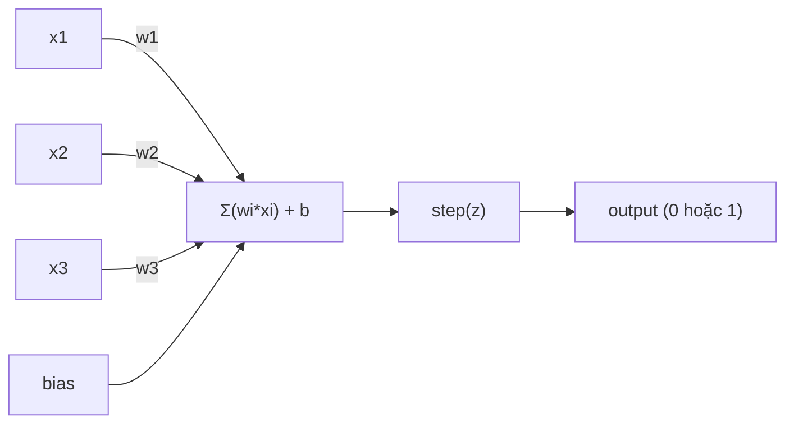
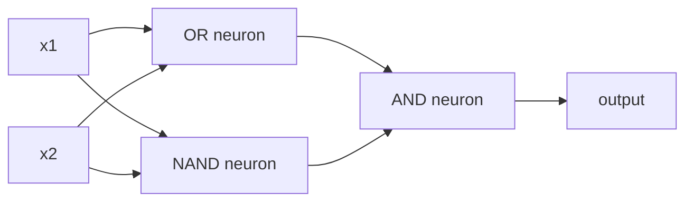

# The Perceptron

> Perceptron là nguyên tử của neural network. Mổ nó ra bạn sẽ thấy weights, bias, và một quyết định.

**Loại:** Xây dựng
**Ngôn ngữ:** Python
**Yêu cầu trước:** Phase 1 (Trực giác Linear Algebra)
**Thời gian:** ~60 phút

## Mục tiêu học tập

- Tự xây dựng một perceptron từ đầu bằng Python, bao gồm weight update rule và step activation function
- Giải thích tại sao một perceptron đơn lẻ chỉ giải được các bài toán linearly separable và minh họa trường hợp thất bại với XOR
- Xây dựng một multi-layer perceptron bằng cách kết hợp các cổng OR, NAND và AND để giải XOR
- Huấn luyện một mạng hai lớp với sigmoid activation và backpropagation để tự động học XOR

## Vấn đề

Bạn đã biết vector và dot product. Bạn biết rằng matrix biến đổi input thành output. Nhưng làm sao máy tính *học* được nên dùng phép biến đổi nào?

Perceptron trả lời câu hỏi đó. Nó là cỗ máy học đơn giản nhất có thể: lấy một số input, nhân với weights, cộng bias, rồi đưa ra quyết định nhị phân. Sau đó điều chỉnh. Chỉ vậy thôi. Mọi neural network từng được xây dựng đều là nhiều lớp ý tưởng này chồng lên nhau.

Hiểu perceptron nghĩa là hiểu "learning" thực sự có nghĩa gì trong code: điều chỉnh các con số cho đến khi output khớp với thực tế.

## Khái niệm

### Một Neuron, Một Quyết định

Perceptron nhận n input, nhân mỗi cái với một weight, cộng tất cả lại, thêm bias, rồi đưa kết quả qua activation function.



Step function rất thẳng thắn: nếu tổng có trọng số cộng bias >= 0, output 1. Ngược lại, output 0.

```
step(z) = 1  nếu z >= 0
           0  nếu z < 0
```

Đây là một linear classifier. Weights và bias xác định một đường thẳng (hoặc hyperplane trong không gian nhiều chiều) chia không gian input thành hai vùng.

### Decision Boundary

Với hai input, perceptron vẽ một đường thẳng trong không gian 2D:

```
  x2
  ┤
  │  Class 1        /
  │    (0)          /
  │                /
  │               / w1·x1 + w2·x2 + b = 0
  │              /
  │             /     Class 2
  │            /        (1)
  ┼───────────/──────────── x1
```

Mọi thứ ở một bên đường thẳng cho output 0. Mọi thứ ở bên kia cho output 1. Training dịch chuyển đường thẳng này cho đến khi nó tách đúng các class.

### Learning Rule

Perceptron learning rule rất đơn giản:

```
Với mỗi training example (x, y_true):
    y_pred = predict(x)
    error = y_true - y_pred

    Với mỗi weight:
        w_i = w_i + learning_rate * error * x_i
    bias = bias + learning_rate * error
```

Nếu dự đoán đúng, error = 0, không thay đổi gì. Nếu dự đoán 0 nhưng đáng lẽ phải là 1, weights tăng lên. Nếu dự đoán 1 nhưng đáng lẽ phải là 0, weights giảm xuống. Learning rate kiểm soát mỗi lần điều chỉnh lớn bao nhiêu.

### Bài toán XOR

Đây là chỗ nó "vỡ". Nhìn các logic gate sau:

```
AND gate:           OR gate:            XOR gate:
x1  x2  out         x1  x2  out         x1  x2  out
0   0   0           0   0   0           0   0   0
0   1   0           0   1   1           0   1   1
1   0   0           1   0   1           1   0   1
1   1   1           1   1   1           1   1   0
```

AND và OR là linearly separable: bạn có thể vẽ một đường thẳng duy nhất để tách các số 0 khỏi các số 1. XOR thì không. Không đường thẳng nào có thể tách [0,1] và [1,0] khỏi [0,0] và [1,1].

```
AND (tách được):        XOR (không tách được):

  x2                      x2
  1 ┤  0     1            1 ┤  1     0
    │     /                 │
  0 ┤  0 / 0              0 ┤  0     1
    ┼──/──────── x1         ┼──────────── x1
       đường thẳng OK!      không đường thẳng nào được!
```

Đây là giới hạn cơ bản. Một perceptron đơn lẻ chỉ giải được bài toán linearly separable. Minsky và Papert chứng minh điều này năm 1969 và nó gần như giết chết nghiên cứu neural network suốt một thập kỷ.

Cách khắc phục: xếp chồng các perceptron thành nhiều layer. Một multi-layer perceptron có thể giải XOR bằng cách kết hợp hai quyết định tuyến tính thành một quyết định phi tuyến.

```figure
perceptron-boundary
```

## Xây dựng

### Bước 1: Class Perceptron

```python
class Perceptron:
    def __init__(self, n_inputs, learning_rate=0.1):
        self.weights = [0.0] * n_inputs
        self.bias = 0.0
        self.lr = learning_rate

    def predict(self, inputs):
        total = sum(w * x for w, x in zip(self.weights, inputs))
        total += self.bias
        return 1 if total >= 0 else 0

    def train(self, training_data, epochs=100):
        for epoch in range(epochs):
            errors = 0
            for inputs, target in training_data:
                prediction = self.predict(inputs)
                error = target - prediction
                if error != 0:
                    errors += 1
                    for i in range(len(self.weights)):
                        self.weights[i] += self.lr * error * inputs[i]
                    self.bias += self.lr * error
            if errors == 0:
                print(f"Converged at epoch {epoch + 1}")
                return
        print(f"Did not converge after {epochs} epochs")
```

### Bước 2: Train trên các logic gate

```python
and_data = [
    ([0, 0], 0),
    ([0, 1], 0),
    ([1, 0], 0),
    ([1, 1], 1),
]

or_data = [
    ([0, 0], 0),
    ([0, 1], 1),
    ([1, 0], 1),
    ([1, 1], 1),
]

not_data = [
    ([0], 1),
    ([1], 0),
]

print("=== AND Gate ===")
p_and = Perceptron(2)
p_and.train(and_data)
for inputs, _ in and_data:
    print(f"  {inputs} -> {p_and.predict(inputs)}")

print("\n=== OR Gate ===")
p_or = Perceptron(2)
p_or.train(or_data)
for inputs, _ in or_data:
    print(f"  {inputs} -> {p_or.predict(inputs)}")

print("\n=== NOT Gate ===")
p_not = Perceptron(1)
p_not.train(not_data)
for inputs, _ in not_data:
    print(f"  {inputs} -> {p_not.predict(inputs)}")
```

### Bước 3: Xem XOR thất bại

```python
xor_data = [
    ([0, 0], 0),
    ([0, 1], 1),
    ([1, 0], 1),
    ([1, 1], 0),
]

print("\n=== XOR Gate (single perceptron) ===")
p_xor = Perceptron(2)
p_xor.train(xor_data, epochs=1000)
for inputs, expected in xor_data:
    result = p_xor.predict(inputs)
    status = "OK" if result == expected else "SAI"
    print(f"  {inputs} -> {result} (expected {expected}) {status}")
```

Nó sẽ không bao giờ converge. Đây là bằng chứng rõ ràng rằng một perceptron đơn lẻ không thể học XOR.

### Bước 4: Giải XOR với hai layer

Mẹo: XOR = (x1 OR x2) AND NOT (x1 AND x2). Kết hợp ba perceptron:



```python
def xor_network(x1, x2):
    or_neuron = Perceptron(2)
    or_neuron.weights = [1.0, 1.0]
    or_neuron.bias = -0.5

    nand_neuron = Perceptron(2)
    nand_neuron.weights = [-1.0, -1.0]
    nand_neuron.bias = 1.5

    and_neuron = Perceptron(2)
    and_neuron.weights = [1.0, 1.0]
    and_neuron.bias = -1.5

    hidden1 = or_neuron.predict([x1, x2])
    hidden2 = nand_neuron.predict([x1, x2])
    output = and_neuron.predict([hidden1, hidden2])
    return output


print("\n=== XOR Gate (multi-layer network) ===")
for inputs, expected in xor_data:
    result = xor_network(inputs[0], inputs[1])
    print(f"  {inputs} -> {result} (expected {expected})")
```

Cả bốn trường hợp đều đúng. Xếp chồng perceptron thành nhiều layer tạo ra decision boundary mà không perceptron đơn lẻ nào có thể tạo được.

### Bước 5: Train mạng hai layer

Bước 4 đã gán tay các weights. Cách đó dùng được cho XOR, nhưng không dùng được cho bài toán thực tế khi bạn không biết trước weights đúng. Cách khắc phục: thay step function bằng sigmoid và tự động học weights thông qua backpropagation.

```python
class TwoLayerNetwork:
    def __init__(self, learning_rate=0.5):
        import random
        random.seed(0)
        self.w_hidden = [[random.uniform(-1, 1), random.uniform(-1, 1)] for _ in range(2)]
        self.b_hidden = [random.uniform(-1, 1), random.uniform(-1, 1)]
        self.w_output = [random.uniform(-1, 1), random.uniform(-1, 1)]
        self.b_output = random.uniform(-1, 1)
        self.lr = learning_rate

    def sigmoid(self, x):
        import math
        x = max(-500, min(500, x))
        return 1.0 / (1.0 + math.exp(-x))

    def forward(self, inputs):
        self.inputs = inputs
        self.hidden_outputs = []
        for i in range(2):
            z = sum(w * x for w, x in zip(self.w_hidden[i], inputs)) + self.b_hidden[i]
            self.hidden_outputs.append(self.sigmoid(z))
        z_out = sum(w * h for w, h in zip(self.w_output, self.hidden_outputs)) + self.b_output
        self.output = self.sigmoid(z_out)
        return self.output

    def train(self, training_data, epochs=10000):
        for epoch in range(epochs):
            total_error = 0
            for inputs, target in training_data:
                output = self.forward(inputs)
                error = target - output
                total_error += error ** 2

                d_output = error * output * (1 - output)

                saved_w_output = self.w_output[:]
                hidden_deltas = []
                for i in range(2):
                    h = self.hidden_outputs[i]
                    hd = d_output * saved_w_output[i] * h * (1 - h)
                    hidden_deltas.append(hd)

                for i in range(2):
                    self.w_output[i] += self.lr * d_output * self.hidden_outputs[i]
                self.b_output += self.lr * d_output

                for i in range(2):
                    for j in range(len(inputs)):
                        self.w_hidden[i][j] += self.lr * hidden_deltas[i] * inputs[j]
                    self.b_hidden[i] += self.lr * hidden_deltas[i]
```

```python
net = TwoLayerNetwork(learning_rate=2.0)
net.train(xor_data, epochs=10000)
for inputs, expected in xor_data:
    result = net.forward(inputs)
    predicted = 1 if result >= 0.5 else 0
    print(f"  {inputs} -> {result:.4f} (rounded: {predicted}, expected {expected})")
```

Hai điểm khác biệt chính so với Bước 4. Thứ nhất, sigmoid thay thế step function -- nó mượt, nên gradient tồn tại. Thứ hai, method `train` lan truyền error ngược từ output về hidden layer, điều chỉnh mỗi weight tỷ lệ với mức đóng góp của nó vào error. Đó là backpropagation trong 20 dòng.

Đây là cầu nối sang Lesson 03. Toán học đằng sau `d_output` và `hidden_deltas` là chain rule áp dụng lên đồ thị mạng. Chúng ta sẽ chứng minh nó đúng cách ở bài đó.

## Sử dụng

Mọi thứ bạn vừa xây từ đầu đều nằm gọn trong một import:

```python
from sklearn.linear_model import Perceptron as SkPerceptron
import numpy as np

X = np.array([[0,0],[0,1],[1,0],[1,1]])
y = np.array([0, 0, 0, 1])

clf = SkPerceptron(max_iter=100, tol=1e-3)
clf.fit(X, y)
print([clf.predict([x])[0] for x in X])
```

Năm dòng. Class `Perceptron` 30 dòng của bạn làm điều tương tự. Phiên bản sklearn thêm convergence check, nhiều loss function, và hỗ trợ sparse input -- nhưng vòng lặp cốt lõi thì giống hệt: tổng có trọng số, step function, cập nhật weight khi có error.

Khoảng cách thật sự lộ ra ở quy mô lớn. Những gì thay đổi trong các mạng production:

- Step function trở thành sigmoid, ReLU, hoặc các smooth activation khác
- Weights được học tự động qua backpropagation (Lesson 03)
- Layer sâu hơn: 3, 10, 100+ layer
- Nguyên lý vẫn giữ nguyên: mỗi layer tạo feature mới từ output của layer trước

Một perceptron đơn lẻ chỉ vẽ được đường thẳng. Xếp chồng chúng lại, bạn có thể vẽ bất kỳ hình dạng nào.

## Ship It

Bài học này tạo ra:
- `outputs/skill-perceptron.md` - một skill mô tả khi nào cần dùng kiến trúc single-layer so với multi-layer

## Bài tập

1. Train một perceptron trên NAND gate (cổng vạn năng - bất kỳ mạch logic nào cũng xây được từ NAND). Xác minh weights và bias của nó tạo thành decision boundary hợp lệ.
2. Sửa class Perceptron để theo dõi decision boundary (w1*x1 + w2*x2 + b = 0) ở mỗi epoch. In ra đường thẳng dịch chuyển thế nào trong quá trình training trên AND gate.
3. Xây một perceptron 3 input, output 1 chỉ khi ít nhất 2 trong 3 input là 1 (hàm majority vote). Bài toán này có linearly separable không? Tại sao?

## Thuật ngữ chính

| Thuật ngữ              | Người ta hay nói                         | Ý nghĩa thực sự                                                                                             |
| ---------------------- | ---------------------------------------- | ----------------------------------------------------------------------------------------------------------- |
| Perceptron             | "Một neuron giả"                         | Một linear classifier: dot product của input và weights, cộng bias, đi qua step function                    |
| Weight                 | "Mức độ quan trọng của input"            | Hệ số nhân co giãn phần đóng góp của mỗi input vào quyết định                                              |
| Bias                   | "Ngưỡng"                                 | Hằng số dịch chuyển decision boundary, cho phép perceptron kích hoạt ngay cả khi input bằng 0               |
| Activation function    | "Cái hàm nén giá trị lại"               | Hàm áp dụng sau tổng có trọng số - step function cho perceptron, sigmoid/ReLU cho mạng hiện đại             |
| Linearly separable     | "Vẽ được một đường thẳng giữa chúng"    | Tập dữ liệu mà một hyperplane duy nhất có thể tách hoàn hảo các class                                      |
| XOR problem            | "Cái mà perceptron không làm được"      | Chứng minh rằng mạng single-layer không thể học hàm non-linearly-separable                                  |
| Decision boundary      | "Chỗ classifier chuyển đổi"             | Hyperplane w*x + b = 0 chia không gian input thành hai class                                                 |
| Multi-layer perceptron | "Mạng neural thực sự"                    | Các perceptron xếp chồng thành layer, output của layer này là input cho layer tiếp theo                      |

## Đọc thêm

- Frank Rosenblatt, "The Perceptron: A Probabilistic Model for Information Storage and Organization in the Brain" (1958) -- bài báo gốc khởi đầu tất cả
- Minsky & Papert, "Perceptrons" (1969) -- cuốn sách chứng minh XOR không giải được bằng mạng single-layer và giết chết nghiên cứu perceptron suốt một thập kỷ
- Michael Nielsen, "Neural Networks and Deep Learning", Chapter 1 (http://neuralnetworksanddeeplearning.com/) -- miễn phí online, giải thích trực quan tốt nhất về cách các perceptron kết hợp thành mạng
