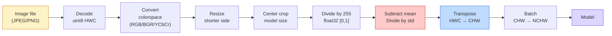
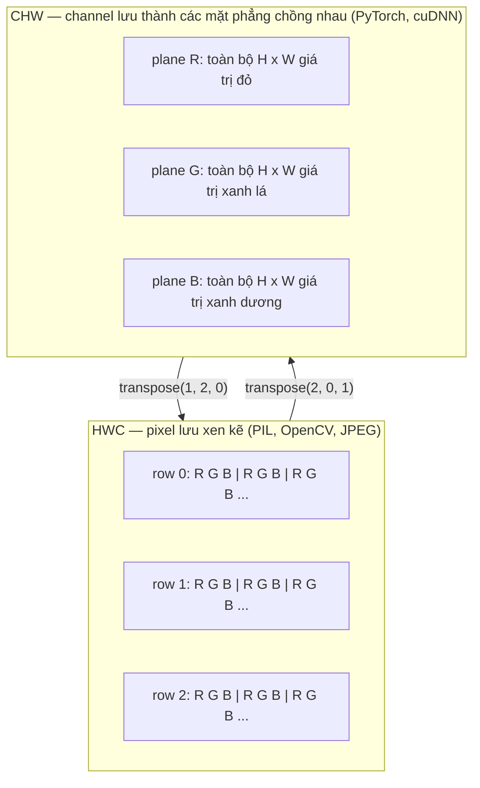

# Image Fundamentals — Pixels, Channels, Color Spaces

> Ảnh là một tensor chứa các mẫu ánh sáng. Mọi model về vision mà bạn sẽ dùng đều bắt đầu từ sự thật này.

- **Type:** Build
- **Languages:** Python
- **Prerequisites:** Phase 1 Lesson 12 (Tensor Operations), Phase 3 Lesson 11 (Intro to PyTorch)
- **Time:** ~45 phút

## Mục tiêu học tập

- Giải thích cách một cảnh liên tục được rời rạc hóa thành các pixel và tại sao các quyết định sampling/quantization đặt ra giới hạn trần cho mọi model phía sau
- Đọc, cắt lát, và kiểm tra ảnh dưới dạng NumPy array, chuyển đổi linh hoạt giữa layout HWC và CHW
- Chuyển đổi giữa RGB, grayscale, HSV, và YCbCr, giải thích tại sao mỗi color space tồn tại
- Áp dụng preprocessing ở mức pixel (normalize, standardize, resize, channel-first) đúng như torchvision yêu cầu

## Vấn đề

Mọi paper bạn sẽ đọc, mọi pretrained weight bạn sẽ tải, mọi vision API bạn sẽ gọi đều giả định một cách encoding cụ thể cho input. Truyền ảnh `uint8` khi model muốn `float32` — nó vẫn chạy — và âm thầm cho ra kết quả rác. Đưa BGR cho network được train trên RGB thì accuracy giảm mười điểm. Đưa input channels-last khi model cần channels-first thì lớp conv đầu tiên sẽ coi height là feature channel. Không có lỗi nào được báo. Nó chỉ phá hỏng metrics và bạn mất cả tuần tìm bug nằm ở cách bạn load file.

Một convolution không phức tạp khi bạn biết nó đang trượt qua cái gì. Phần khó là "một ảnh" có nghĩa khác nhau đối với camera, JPEG decoder, PIL, OpenCV, torchvision, và CUDA kernel. Mỗi stack có axis order, byte range, và channel convention riêng. Một vision engineer không nắm vững những thứ này sẽ ship ra pipeline lỗi.

Bài này sửa lại nền tảng để phần còn lại của phase có thể xây dựng trên đó. Kết thúc bài bạn sẽ biết pixel là gì, tại sao mỗi pixel có ba số thay vì một, "normalize with ImageNet stats" thực sự làm gì, và cách chuyển đổi giữa hai hoặc ba layout mà mọi bài khác trong phase này sẽ giả định.

## Khái niệm

### Toàn cảnh preprocessing pipeline

Mọi hệ thống vision production đều là cùng một chuỗi các transform có thể đảo ngược. Sai một bước và model sẽ nhìn thấy input khác với lúc nó được train.



Hai ô đỏ và xanh là nơi 80% lỗi âm thầm xảy ra: thiếu standardization và sai layout.

### Pixel là một mẫu đo, không phải ô vuông

Cảm biến camera đếm photon rơi trên một lưới các detector nhỏ. Mỗi detector tích hợp ánh sáng trong một phần giây và phát ra điện áp tỷ lệ với số photon chạm vào nó. Cảm biến sau đó rời rạc hóa điện áp đó thành một số nguyên. Một detector trở thành một pixel.

```
Cảnh liên tục                    Lưới cảm biến                   Ảnh số
(chi tiết vô hạn)               (H x W detector)                (H x W số nguyên)

    ~~~~~                        +--+--+--+--+--+                 210 198 180 155 120
   ~   ~   ~                     |  |  |  |  |  |                 205 195 178 152 118
  ~ ánh sáng ~      ---->        +--+--+--+--+--+     ---->       200 190 175 150 115
   ~~~~~                         |  |  |  |  |  |                 195 185 170 148 112
                                 +--+--+--+--+--+                 188 180 165 145 108
```

Hai lựa chọn xảy ra ở bước này và chúng đặt ra giới hạn trần cho mọi thứ phía sau:

- **Spatial sampling** quyết định bao nhiêu detector trên mỗi độ của cảnh. Quá ít, cạnh sẽ bị răng cưa (aliasing). Quá nhiều, storage và compute sẽ bùng nổ.
- **Intensity quantization** quyết định điện áp được chia nhỏ thế nào. 8 bit cho 256 mức và là chuẩn cho hiển thị. 10, 12, 16 bit cho gradient mượt hơn và quan trọng cho medical imaging, HDR, và raw sensor pipeline.

Pixel không phải ô vuông có màu có diện tích. Nó là một phép đo đơn lẻ. Khi bạn resize hoặc rotate, bạn đang resampling lưới đo đó.

### Tại sao có ba channel

Một detector đếm photon trên toàn bộ phổ ánh sáng nhìn thấy — đó là grayscale. Để có màu sắc, cảm biến phủ lên lưới một mosaic gồm các filter đỏ, xanh lá, và xanh dương. Sau khi demosaicing, mỗi vị trí không gian có ba số nguyên: phản hồi của detector lọc đỏ, lọc xanh lá, và lọc xanh dương gần đó. Ba số nguyên đó là RGB triplet của pixel.

```
Một pixel trong bộ nhớ:

    (R, G, B) = (210, 140, 30)   <- cam đỏ

Ảnh RGB kích thước H x W:

    shape (H, W, 3)     lưu trữ dưới dạng   H hàng gồm W pixel, mỗi pixel 3 giá trị
                                              mỗi giá trị trong [0, 255] cho uint8
```

Ba không phải con số kỳ diệu. Depth camera thêm channel Z. Vệ tinh thêm dải hồng ngoại và tử ngoại. Ảnh y tế thường có một channel (X-ray, CT) hoặc nhiều (hyperspectral). Số channel là trục cuối cùng; conv layer học cách trộn theo trục đó.

### Hai quy ước layout: HWC và CHW

Cùng một tensor, hai cách sắp xếp. Mỗi thư viện chọn một cách.

```
HWC (height, width, channels)           CHW (channels, height, width)

   W ->                                    H ->
  +-----+-----+-----+                     +-----+-----+
H |R G B|R G B|R G B|                   C |R R R R R R|
| +-----+-----+-----+                   | +-----+-----+
v |R G B|R G B|R G B|                   v |G G G G G G|
  +-----+-----+-----+                     +-----+-----+
                                          |B B B B B B|
                                          +-----+-----+

   PIL, OpenCV, matplotlib,              PyTorch, hầu hết các deep learning
   hầu hết mọi file ảnh trên disk       framework, cuDNN kernel
```

CHW tồn tại vì convolution kernel trượt qua H và W. Giữ channel axis ở đầu nghĩa là mỗi kernel nhìn thấy một mặt phẳng 2D liền mạch cho mỗi channel, giúp vectorize hiệu quả. Format trên disk dùng HWC vì nó khớp với cách scanline ra từ cảm biến.

Dòng chuyển đổi bạn sẽ gõ cả ngàn lần:

```
img_chw = img_hwc.transpose(2, 0, 1)      # NumPy
img_chw = img_hwc.permute(2, 0, 1)        # PyTorch tensor
```

Memory layout, minh họa:



### Byte range và dtype

Ba quy ước chính:

| Quy ước | dtype | Range | Ở đâu |
|---------|-------|-------|--------|
| Raw | `uint8` | [0, 255] | File trên disk, PIL, output của OpenCV |
| Normalized | `float32` | [0.0, 1.0] | Sau `img.astype('float32') / 255` |
| Standardized | `float32` | khoảng [-2, +2] | Sau khi trừ mean và chia std |

Convolutional network được train trên input đã standardized. ImageNet stats `mean=[0.485, 0.456, 0.406]`, `std=[0.229, 0.224, 0.225]` là trung bình cộng và độ lệch chuẩn của ba channel trên toàn bộ tập ImageNet training, tính trên pixel đã normalized về [0, 1]. Đưa `uint8` raw vào model cần standardized float là lỗi âm thầm phổ biến nhất trong applied vision.

### Color space và tại sao chúng tồn tại

RGB là format thu nhận nhưng không phải lúc nào cũng là biểu diễn hữu ích nhất cho model.

```
 RGB               HSV                       YCbCr / YUV

 R red             H hue (góc 0-360)         Y luminance (độ sáng)
 G green           S saturation (0-1)        Cb chroma xanh dương-vàng
 B blue            V value/brightness (0-1)  Cr chroma đỏ-xanh lá

 Tuyến tính theo    Tách color khỏi          Tách brightness khỏi
 output cảm biến   brightness. Hữu ích      color. JPEG và hầu hết video
                   cho color thresholding,   codec nén các chroma
                   UI slider, filter đơn     channel mạnh hơn vì mắt
                   giản                      người ít nhạy với chi tiết
                                             chroma hơn so với Y.
```

Với hầu hết CNN hiện đại bạn đưa vào RGB. Bạn gặp các space khác khi:

- **HSV** — code CV cổ điển, color-based segmentation, white-balancing.
- **YCbCr** — đọc nội dung JPEG, video pipeline, super-resolution model chỉ xử lý trên Y.
- **Grayscale** — OCR, document model, mọi trường hợp color là biến nhiễu chứ không phải tín hiệu.

Grayscale từ RGB là tổng có trọng số, không phải trung bình, vì mắt người nhạy hơn với xanh lá so với đỏ hoặc xanh dương:

```
Y = 0.299 R + 0.587 G + 0.114 B       (ITU-R BT.601, bộ trọng số kinh điển)
```

### Aspect ratio, resize, và interpolation

Mọi model có kích thước input cố định (224x224 cho hầu hết ImageNet classifier, 384x384 hoặc 512x512 cho các detector hiện đại). Ảnh của bạn hiếm khi khớp. Ba lựa chọn resize quan trọng:

- **Resize cạnh ngắn, rồi center crop** — công thức chuẩn ImageNet. Giữ nguyên aspect ratio, bỏ đi một dải pixel ở mép.
- **Resize rồi pad** — giữ nguyên aspect ratio và mọi pixel, thêm viền đen. Chuẩn cho detection và OCR.
- **Resize trực tiếp về kích thước đích** — kéo giãn ảnh. Rẻ, méo hình học, ổn cho nhiều bài classification.

Phương pháp interpolation quyết định cách tính pixel trung gian khi lưới mới không khớp với lưới cũ:

```
Nearest neighbour     nhanh nhất, vuông vức, lựa chọn duy nhất cho mask/label
Bilinear              nhanh, mượt, mặc định cho hầu hết resize
Bicubic               chậm hơn, sắc nét hơn khi upscale
Lanczos               chậm nhất, chất lượng tốt nhất, dùng cho hiển thị cuối
```

Quy tắc chung: bilinear cho training, bicubic hoặc lanczos cho asset bạn sẽ xem, nearest cho mọi thứ chứa integer class ID.

```figure
conv-output-size
```

## Build It

### Bước 1: Load ảnh và kiểm tra shape

Dùng Pillow để load bất kỳ JPEG hoặc PNG nào, chuyển sang NumPy, và in ra kết quả. Để có ví dụ cố định chạy offline, tạo ảnh tổng hợp.

```python
import numpy as np
from PIL import Image

def synthetic_rgb(h=128, w=192, seed=0):
    rng = np.random.default_rng(seed)
    yy, xx = np.meshgrid(np.linspace(0, 1, h), np.linspace(0, 1, w), indexing="ij")
    r = (np.sin(xx * 6) * 0.5 + 0.5) * 255
    g = yy * 255
    b = (1 - yy) * xx * 255
    rgb = np.stack([r, g, b], axis=-1) + rng.normal(0, 6, (h, w, 3))
    return np.clip(rgb, 0, 255).astype(np.uint8)

arr = synthetic_rgb()
# Hoặc load từ disk:
# arr = np.asarray(Image.open("your_image.jpg").convert("RGB"))

print(f"type:   {type(arr).__name__}")
print(f"dtype:  {arr.dtype}")
print(f"shape:  {arr.shape}     # (H, W, C)")
print(f"min:    {arr.min()}")
print(f"max:    {arr.max()}")
print(f"pixel at (0, 0): {arr[0, 0]}")
```

Output kỳ vọng: `shape: (H, W, 3)`, `dtype: uint8`, range `[0, 255]`. Đó là biểu diễn chuẩn trên disk dù byte đến từ camera, JPEG decoder, hay bộ tạo tổng hợp.

### Bước 2: Tách channel và đổi layout

Tách riêng R, G, B, rồi chuyển từ HWC sang CHW cho PyTorch.

```python
R = arr[:, :, 0]
G = arr[:, :, 1]
B = arr[:, :, 2]
print(f"R shape: {R.shape}, mean: {R.mean():.1f}")
print(f"G shape: {G.shape}, mean: {G.mean():.1f}")
print(f"B shape: {B.shape}, mean: {B.mean():.1f}")

arr_chw = arr.transpose(2, 0, 1)
print(f"\nHWC shape: {arr.shape}")
print(f"CHW shape: {arr_chw.shape}")
```

Ba mặt phẳng grayscale, mỗi cái cho một channel. CHW chỉ sắp xếp lại các trục; không nhất thiết phải copy dữ liệu khi memory layout cho phép.

### Bước 3: Chuyển đổi Grayscale và HSV

Grayscale bằng tổng có trọng số, rồi chuyển RGB sang HSV thủ công.

```python
def rgb_to_grayscale(rgb):
    weights = np.array([0.299, 0.587, 0.114], dtype=np.float32)
    return (rgb.astype(np.float32) @ weights).astype(np.uint8)

def rgb_to_hsv(rgb):
    rgb_f = rgb.astype(np.float32) / 255.0
    r, g, b = rgb_f[..., 0], rgb_f[..., 1], rgb_f[..., 2]
    cmax = np.max(rgb_f, axis=-1)
    cmin = np.min(rgb_f, axis=-1)
    delta = cmax - cmin

    h = np.zeros_like(cmax)
    mask = delta > 0
    rmax = mask & (cmax == r)
    gmax = mask & (cmax == g)
    bmax = mask & (cmax == b)
    h[rmax] = ((g[rmax] - b[rmax]) / delta[rmax]) % 6
    h[gmax] = ((b[gmax] - r[gmax]) / delta[gmax]) + 2
    h[bmax] = ((r[bmax] - g[bmax]) / delta[bmax]) + 4
    h = h * 60.0

    s = np.where(cmax > 0, delta / cmax, 0)
    v = cmax
    return np.stack([h, s, v], axis=-1)

gray = rgb_to_grayscale(arr)
hsv = rgb_to_hsv(arr)
print(f"gray shape: {gray.shape}, range: [{gray.min()}, {gray.max()}]")
print(f"hsv   shape: {hsv.shape}")
print(f"hue range: [{hsv[..., 0].min():.1f}, {hsv[..., 0].max():.1f}] degrees")
print(f"sat range: [{hsv[..., 1].min():.2f}, {hsv[..., 1].max():.2f}]")
print(f"val range: [{hsv[..., 2].min():.2f}, {hsv[..., 2].max():.2f}]")
```

Hue ra theo đơn vị độ, saturation và value trong [0, 1]. Khớp với quy ước `hsv_full` của OpenCV.

### Bước 4: Normalize, standardize, và đảo ngược

Từ byte raw đến đúng tensor mà pretrained ImageNet model cần, rồi chuyển ngược lại.

```python
mean = np.array([0.485, 0.456, 0.406], dtype=np.float32)
std = np.array([0.229, 0.224, 0.225], dtype=np.float32)

def preprocess_imagenet(rgb_uint8):
    x = rgb_uint8.astype(np.float32) / 255.0
    x = (x - mean) / std
    x = x.transpose(2, 0, 1)
    return x

def deprocess_imagenet(chw_float32):
    x = chw_float32.transpose(1, 2, 0)
    x = x * std + mean
    x = np.clip(x * 255.0, 0, 255).astype(np.uint8)
    return x

x = preprocess_imagenet(arr)
print(f"preprocessed shape: {x.shape}     # (C, H, W)")
print(f"preprocessed dtype: {x.dtype}")
print(f"preprocessed mean per channel:  {x.mean(axis=(1, 2)).round(3)}")
print(f"preprocessed std  per channel:  {x.std(axis=(1, 2)).round(3)}")

roundtrip = deprocess_imagenet(x)
max_diff = np.abs(roundtrip.astype(int) - arr.astype(int)).max()
print(f"roundtrip max pixel diff: {max_diff}    # nên là 0 hoặc 1")
```

Mean mỗi channel nên gần zero, std gần one. Cặp preprocess/deprocess chính xác là những gì mà mọi lệnh `transforms.Normalize` của torchvision làm bên dưới.

### Bước 5: Resize với ba phương pháp interpolation

So sánh nearest, bilinear, và bicubic trên upscale để thấy rõ sự khác biệt.

```python
target = (arr.shape[0] * 3, arr.shape[1] * 3)

nearest = np.asarray(Image.fromarray(arr).resize(target[::-1], Image.NEAREST))
bilinear = np.asarray(Image.fromarray(arr).resize(target[::-1], Image.BILINEAR))
bicubic = np.asarray(Image.fromarray(arr).resize(target[::-1], Image.BICUBIC))

def local_roughness(x):
    gy = np.diff(x.astype(float), axis=0)
    gx = np.diff(x.astype(float), axis=1)
    return float(np.abs(gy).mean() + np.abs(gx).mean())

for name, out in [("nearest", nearest), ("bilinear", bilinear), ("bicubic", bicubic)]:
    print(f"{name:>8}  shape={out.shape}  roughness={local_roughness(out):6.2f}")
```

Nearest có roughness cao nhất vì giữ cạnh cứng. Bilinear mượt nhất. Bicubic ở giữa, giữ được độ sắc nét mà không bị hiện tượng bậc thang.

## Use It

`torchvision.transforms` gói gọn mọi thứ ở trên thành một pipeline có thể kết hợp. Code dưới đây tái tạo chính xác những gì `preprocess_imagenet` làm, cộng thêm resize và crop.

```python
import torch
from torchvision import transforms
from PIL import Image

img = Image.fromarray(synthetic_rgb(256, 256))

pipeline = transforms.Compose([
    transforms.Resize(256),
    transforms.CenterCrop(224),
    transforms.ToTensor(),
    transforms.Normalize(mean=[0.485, 0.456, 0.406], std=[0.229, 0.224, 0.225]),
])

x = pipeline(img)
print(f"tensor type:  {type(x).__name__}")
print(f"tensor dtype: {x.dtype}")
print(f"tensor shape: {tuple(x.shape)}      # (C, H, W)")
print(f"per-channel mean: {x.mean(dim=(1, 2)).tolist()}")
print(f"per-channel std:  {x.std(dim=(1, 2)).tolist()}")

batch = x.unsqueeze(0)
print(f"\nbatched shape: {tuple(batch.shape)}   # (N, C, H, W) — sẵn sàng cho model")
```

Bốn bước, đúng thứ tự này: `Resize(256)` scale cạnh ngắn về 256; `CenterCrop(224)` lấy patch 224x224 từ giữa; `ToTensor()` chia cho 255 và đổi HWC sang CHW; `Normalize` trừ ImageNet mean và chia std. Đảo thứ tự sẽ âm thầm thay đổi input đến model.

## Ship It

Bài này tạo ra:

- `outputs/prompt-vision-preprocessing-audit.md` — một prompt biến bất kỳ model card hoặc dataset card nào thành checklist các preprocessing invariant chính xác mà team phải tuân thủ.
- `outputs/skill-image-tensor-inspector.md` — một skill khi nhận bất kỳ tensor hoặc array có shape ảnh nào, báo cáo dtype, layout, range, và liệu nó trông như raw, normalized, hay standardized.

## Bài tập

1. **(Dễ)** Load một JPEG bằng OpenCV (`cv2.imread`) và bằng Pillow. In cả hai shape và pixel tại `(0, 0)`. Giải thích sự khác biệt channel-order, rồi viết dòng chuyển đổi để array OpenCV giống hệt array Pillow.
2. **(Trung bình)** Viết `standardize(img, mean, std)` và hàm ngược sao cho cả hai cùng pass test `roundtrip_max_diff <= 1` trên mọi ảnh uint8. Hàm phải hoạt động trên một ảnh HWC lẫn trên batch NCHW với cùng một lệnh gọi.
3. **(Khó)** Lấy tensor ImageNet-standardized 3 channel và chạy qua 1x1 conv để học weighted mixture từ RGB thành một grayscale channel. Khởi tạo weight là `[0.299, 0.587, 0.114]`, freeze chúng, và xác minh output khớp với `rgb_to_grayscale` thủ công trong phạm vi floating-point error. Những color-space transform cổ điển nào khác có thể viết dưới dạng 1x1 convolution?

## Thuật ngữ chính

| Thuật ngữ | Người ta hay nói | Ý nghĩa thực sự |
| --------- | ---------------- | ---------------- |
| Pixel | "Ô vuông có màu" | Một mẫu đo cường độ ánh sáng tại một vị trí lưới — ba số cho color, một cho grayscale |
| Channel | "Màu sắc" | Một trong các lưới không gian song song xếp chồng thành image tensor; trục cuối trong HWC, trục đầu trong CHW |
| HWC / CHW | "Cái shape" | Thứ tự trục cho image tensor; disk và PIL dùng HWC, PyTorch và cuDNN dùng CHW |
| Normalize | "Scale ảnh" | Chia cho 255 để pixel nằm trong [0, 1] — cần thiết nhưng chưa đủ |
| Standardize | "Zero-center" | Trừ mean và chia std theo từng channel để phân phối input khớp với phân phối lúc model được train |
| Grayscale conversion | "Trung bình các channel" | Tổng có trọng số với hệ số 0.299/0.587/0.114 khớp với cảm nhận luminance của mắt người |
| Interpolation | "Cách resize chọn pixel" | Quy tắc xác định giá trị output khi lưới mới không khớp lưới cũ — nearest cho label, bilinear cho training, bicubic cho hiển thị |
| Aspect ratio | "Width chia height" | Tỷ lệ phân biệt "resize rồi pad" với "resize rồi kéo giãn" |

## Đọc thêm

- [Charles Poynton — A Guided Tour of Color Space](https://poynton.ca/PDFs/Guided_tour.pdf) — giải thích kỹ thuật rõ ràng nhất về tại sao có nhiều color space và khi nào mỗi cái quan trọng
- [PyTorch Vision Transforms Docs](https://pytorch.org/vision/stable/transforms.html) — toàn bộ pipeline transform bạn sẽ compose trong production
- [How JPEG Works (Colt McAnlis)](https://www.youtube.com/watch?v=F1kYBnY6mwg) — tour trực quan sắc nét về chroma subsampling, DCT, và tại sao JPEG encode YCbCr thay vì RGB
- [ImageNet Preprocessing Conventions (torchvision models)](https://pytorch.org/vision/stable/models.html) — nguồn chính xác cho `mean=[0.485, 0.456, 0.406]` và tại sao mọi model trong zoo đều cần nó
